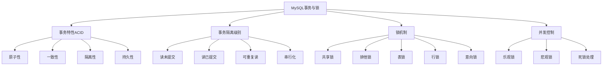

# 🔒 MySQL 事务与锁机制


---

## 🎯 1. 事务基础概念

### 1.1 什么是事务
事务是数据库操作的最小工作单元，是作为单个逻辑工作单元执行的一系列操作。

### 1.2 事务的特性 (ACID)
| 特性 | 说明 | 实现机制 |
| :--- | :--- | :--- |
| **原子性** (Atomicity) | 事务中的所有操作要么全部完成，要么全部不完成 | Undo Log |
| **一致性** (Consistency) | 事务执行前后数据库状态保持一致 | 约束、触发器 |
| **隔离性** (Isolation) | 并发事务之间相互隔离 | 锁机制、MVCC |
| **持久性** (Durability) | 事务提交后对数据库的修改是永久的 | Redo Log |

## 🎯 2. 事务基本操作

### 2.1 事务控制语句
```sql
-- 开始事务
START TRANSACTION;
-- 或者
BEGIN;

-- 提交事务
COMMIT;

-- 回滚事务
ROLLBACK;

-- 设置保存点
SAVEPOINT savepoint_name;

-- 回滚到保存点
ROLLBACK TO SAVEPOINT savepoint_name;

-- 释放保存点
RELEASE SAVEPOINT savepoint_name;
```

### 2.2 事务使用示例
```sql
-- 银行转账示例
START TRANSACTION;

-- 扣除转出账户金额
UPDATE accounts SET balance = balance - 1000 
WHERE account_id = 1 AND balance >= 1000;

-- 如果受影响行数为0，说明余额不足
IF ROW_COUNT() = 0 THEN
    ROLLBACK;
    SELECT '转账失败：余额不足' AS result;
ELSE
    -- 增加转入账户金额
    UPDATE accounts SET balance = balance + 1000 
    WHERE account_id = 2;
    
    -- 记录交易日志
    INSERT INTO transactions (from_account, to_account, amount, transaction_time)
    VALUES (1, 2, 1000, NOW());
    
    COMMIT;
    SELECT '转账成功' AS result;
END IF;
```

### 2.3 自动提交设置
```sql
-- 查看自动提交设置
SELECT @@autocommit;

-- 关闭自动提交
SET autocommit = 0;

-- 开启自动提交
SET autocommit = 1;

-- 会话级别设置
SET SESSION autocommit = 0;

-- 全局级别设置
SET GLOBAL autocommit = 0;
```

## 🎯 3. 事务隔离级别

### 3.1 隔离级别概述
MySQL支持四种事务隔离级别，用于控制事务之间的可见性。

### 3.2 隔离级别设置
```sql
-- 查看当前隔离级别
SELECT @@transaction_isolation;

-- 设置会话隔离级别
SET SESSION TRANSACTION ISOLATION LEVEL READ COMMITTED;

-- 设置全局隔离级别
SET GLOBAL TRANSACTION ISOLATION LEVEL REPEATABLE READ;

-- 在事务中设置隔离级别
START TRANSACTION;
SET TRANSACTION ISOLATION LEVEL SERIALIZABLE;
```

### 3.3 读未提交 (READ UNCOMMITTED)
```sql
-- 设置读未提交级别
SET SESSION TRANSACTION ISOLATION LEVEL READ UNCOMMITTED;

-- 可能读到其他事务未提交的数据（脏读）
-- 事务A
START TRANSACTION;
UPDATE accounts SET balance = 2000 WHERE account_id = 1;

-- 事务B（在读未提交级别下）
START TRANSACTION;
SELECT balance FROM accounts WHERE account_id = 1; -- 可能读到2000

-- 如果事务A回滚，事务B读到的就是脏数据
```

### 3.4 读已提交 (READ COMMITTED)
```sql
-- 设置读已提交级别
SET SESSION TRANSACTION ISOLATION LEVEL READ COMMITTED;

-- 解决脏读，但可能出现不可重复读
-- 事务A
START TRANSACTION;
SELECT balance FROM accounts WHERE account_id = 1; -- 第一次读取

-- 事务B
START TRANSACTION;
UPDATE accounts SET balance = 3000 WHERE account_id = 1;
COMMIT;

-- 事务A再次读取
SELECT balance FROM accounts WHERE account_id = 1; -- 结果可能变化（不可重复读）
```

### 3.5 可重复读 (REPEATABLE READ)
```sql
-- MySQL默认隔离级别
SET SESSION TRANSACTION ISOLATION LEVEL REPEATABLE READ;

-- 解决不可重复读，但可能出现幻读
-- 事务A
START TRANSACTION;
SELECT COUNT(*) FROM accounts WHERE balance > 1000; -- 第一次计数

-- 事务B
START TRANSACTION;
INSERT INTO accounts (account_id, balance) VALUES (3, 2000);
COMMIT;

-- 事务A再次计数
SELECT COUNT(*) FROM accounts WHERE balance > 1000; -- 结果相同（可重复读）
-- 但新插入的数据可能被看到（幻读）
```

### 3.6 串行化 (SERIALIZABLE)
```sql
-- 最高隔离级别
SET SESSION TRANSACTION ISOLATION LEVEL SERIALIZABLE;

-- 完全串行执行，解决所有并发问题，但性能最低
-- 事务A
START TRANSACTION;
SELECT * FROM accounts WHERE balance > 1000 FOR UPDATE;

-- 事务B需要等待事务A完成才能执行相关操作
START TRANSACTION;
UPDATE accounts SET balance = 4000 WHERE account_id = 1; -- 需要等待
```

## 🎯 4. 锁机制

### 4.1 锁类型分类
```sql
-- 查看当前锁信息
SHOW ENGINE INNODB STATUS;
SELECT * FROM information_schema.INNODB_LOCKS;
SELECT * FROM information_schema.INNODB_LOCK_WAITS;
```

### 4.2 共享锁与排他锁
```sql
-- 共享锁（读锁）
SELECT * FROM accounts WHERE account_id = 1 LOCK IN SHARE MODE;

-- 多个事务可以同时持有共享锁
-- 但不能与排他锁共存

-- 排他锁（写锁）
SELECT * FROM accounts WHERE account_id = 1 FOR UPDATE;

-- 只有当前事务可以访问，其他事务不能加任何锁
```

### 4.3 行锁与表锁
```sql
-- 行级锁（InnoDB默认）
UPDATE accounts SET balance = balance - 100 WHERE account_id = 1;
-- 只锁定account_id=1的行

-- 表级锁（MyISAM默认）
LOCK TABLES accounts WRITE;
-- 锁定整个表
UNLOCK TABLES;
```

### 4.4 意向锁
```sql
-- 意向共享锁（IS）
-- 事务在获取行共享锁前，先获取表的意向共享锁

-- 意向排他锁（IX）
-- 事务在获取行排他锁前，先获取表的意向排他锁

-- 意向锁是表级锁，用于快速判断表中是否有行被锁定
```

## 🎯 5. 死锁处理

### 5.1 死锁产生场景
```sql
-- 事务A
START TRANSACTION;
UPDATE accounts SET balance = balance - 100 WHERE account_id = 1;
UPDATE accounts SET balance = balance + 100 WHERE account_id = 2;

-- 事务B（同时执行）
START TRANSACTION;
UPDATE accounts SET balance = balance - 200 WHERE account_id = 2;
UPDATE accounts SET balance = balance + 200 WHERE account_id = 1;

-- 可能发生死锁：A锁1等2，B锁2等1
```

### 5.2 死锁检测与处理
```sql
-- 查看死锁配置
SHOW VARIABLES LIKE 'innodb_deadlock_detect';
SHOW VARIABLES LIKE 'innodb_lock_wait_timeout';

-- 设置锁等待超时时间
SET SESSION innodb_lock_wait_timeout = 50;

-- 死锁自动检测（默认开启）
-- InnoDB会自动检测死锁并回滚其中一个事务

-- 手动处理死锁
SHOW ENGINE INNODB STATUS; -- 查看死锁信息
-- 根据信息决定终止哪个事务
```

### 5.3 死锁预防策略
```sql
-- 1. 按相同顺序访问表
-- 所有事务都按account_id升序访问

-- 2. 减少事务长度
-- 尽快提交事务，减少锁持有时间

-- 3. 使用合适的索引
-- 确保查询使用索引，减少锁范围

-- 4. 使用乐观锁
SELECT balance, version FROM accounts WHERE account_id = 1;

UPDATE accounts 
SET balance = balance - 100, version = version + 1 
WHERE account_id = 1 AND version = @old_version;
```

## 🎯 6. 多版本并发控制 (MVCC)

### 6.1 MVCC原理
```sql
-- InnoDB通过undo log实现MVCC
-- 每个行记录包含两个隐藏字段：
-- DB_TRX_ID: 最后修改该行的事务ID
-- DB_ROLL_PTR: 指向该行之前版本的指针

-- 查询时只看到已提交的数据版本
```

### 6.2 快照读与当前读
```sql
-- 快照读（一致性读）
SELECT * FROM accounts WHERE account_id = 1;
-- 读取事务开始时的数据快照

-- 当前读（锁定读）
SELECT * FROM accounts WHERE account_id = 1 FOR UPDATE;
SELECT * FROM accounts WHERE account_id = 1 LOCK IN SHARE MODE;
-- 读取最新已提交数据，并加锁
```

### 6.3 Read View机制
```sql
-- Read View包含：
-- m_ids: 活跃事务ID列表
-- min_trx_id: 最小活跃事务ID
-- max_trx_id: 预分配的下一个事务ID
-- creator_trx_id: 创建该Read View的事务ID

-- 数据可见性判断规则：
-- 如果trx_id < min_trx_id，数据可见
-- 如果trx_id >= max_trx_id，数据不可见
-- 如果trx_id在m_ids中，数据不可见
```

## 🎯 7. 事务最佳实践

### 7.1 事务设计原则
```sql
-- 1. 事务要短小精悍
START TRANSACTION;
-- 只包含必要的操作
COMMIT;

-- 2. 避免在事务中交互
-- 不要在事务中等待用户输入

-- 3. 合理设置隔离级别
SET TRANSACTION ISOLATION LEVEL READ COMMITTED;

-- 4. 使用合适的锁粒度
SELECT * FROM table WHERE condition FOR UPDATE; -- 行锁
```

### 7.2 性能优化建议
```sql
-- 1. 批量操作减少事务次数
START TRANSACTION;
INSERT INTO table VALUES (1), (2), (3); -- 批量插入
COMMIT;

-- 2. 使用延迟关联
UPDATE large_table 
SET status = 'processed' 
WHERE id IN (
    SELECT id FROM (
        SELECT id FROM large_table 
        WHERE status = 'pending' 
        LIMIT 1000
    ) AS temp
);

-- 3. 监控长事务
SELECT * FROM information_schema.INNODB_TRX 
WHERE TIME_TO_SEC(TIMEDIFF(NOW(), trx_started)) > 60;
```

### 7.3 错误处理机制
```sql
-- 使用存储过程处理复杂事务
DELIMITER //
CREATE PROCEDURE transfer_funds(
    IN from_acc INT, 
    IN to_acc INT, 
    IN amount DECIMAL(10,2)
)
BEGIN
    DECLARE EXIT HANDLER FOR SQLEXCEPTION
    BEGIN
        ROLLBACK;
        RESIGNAL;
    END;
    
    START TRANSACTION;
    
    -- 检查余额
    IF (SELECT balance FROM accounts WHERE account_id = from_acc) < amount THEN
        ROLLBACK;
        SIGNAL SQLSTATE '45000' SET MESSAGE_TEXT = '余额不足';
    END IF;
    
    -- 执行转账
    UPDATE accounts SET balance = balance - amount WHERE account_id = from_acc;
    UPDATE accounts SET balance = balance + amount WHERE account_id = to_acc;
    
    COMMIT;
END //
DELIMITER ;
```

## 🎯 8. 实战案例分析

### 8.1 电商库存管理
```sql
-- 使用悲观锁管理库存
START TRANSACTION;

-- 检查并锁定库存
SELECT stock, version FROM products 
WHERE product_id = 1001 AND stock >= 5 FOR UPDATE;

IF FOUND_ROWS() = 0 THEN
    ROLLBACK;
    SELECT '库存不足' AS result;
ELSE
    -- 减少库存
    UPDATE products SET stock = stock - 5 WHERE product_id = 1001;
    
    -- 创建订单
    INSERT INTO orders (product_id, quantity, order_time)
    VALUES (1001, 5, NOW());
    
    COMMIT;
    SELECT '下单成功' AS result;
END IF;
```

### 8.2 并发计数器
```sql
-- 使用乐观锁实现并发安全计数器
DELIMITER //
CREATE PROCEDURE safe_increment(IN counter_name VARCHAR(50))
BEGIN
    DECLARE old_value INT;
    DECLARE old_version INT;
    DECLARE attempts INT DEFAULT 0;
    
    WHILE attempts < 3 DO
        -- 读取当前值和版本
        SELECT value, version INTO old_value, old_version 
        FROM counters WHERE name = counter_name;
        
        -- 尝试更新
        UPDATE counters 
        SET value = old_value + 1, version = old_version + 1
        WHERE name = counter_name AND version = old_version;
        
        -- 检查是否更新成功
        IF ROW_COUNT() > 0 THEN
            COMMIT;
            SELECT '更新成功' AS result;
            LEAVE;
        END IF;
        
        SET attempts = attempts + 1;
        DO SLEEP(0.1); -- 短暂等待后重试
    END WHILE;
    
    SELECT '更新失败' AS result;
END //
DELIMITER ;
```

### 8.3 数据归档事务
```sql
-- 大数据量归档操作
START TRANSACTION;

-- 归档旧数据
INSERT INTO orders_archive
SELECT * FROM orders 
WHERE order_date < '2023-01-01';

-- 删除已归档数据
DELETE FROM orders 
WHERE order_date < '2023-01-01';

-- 分批提交（避免长事务）
-- 可以使用保存点实现部分提交
SAVEPOINT batch_1000;
-- 每处理1000行释放一次保存点

COMMIT;
```

## 💡 9. 监控与调试

### 9.1 事务监控命令
```sql
-- 查看当前活动事务
SELECT * FROM information_schema.INNODB_TRX;

-- 查看锁信息
SELECT * FROM information_schema.INNODB_LOCKS;
SELECT * FROM information_schema.INNODB_LOCK_WAITS;

-- 查看进程列表
SHOW PROCESSLIST;

-- 查看InnoDB状态
SHOW ENGINE INNODB STATUS;
```

### 9.2 性能诊断
```sql
-- 分析长事务
SELECT 
    trx_id,
    TIMEDIFF(NOW(), trx_started) AS duration,
    trx_state,
    trx_operation_state
FROM information_schema.INNODB_TRX 
ORDER BY trx_started;

-- 锁等待分析
SELECT 
    r.trx_id AS waiting_trx_id,
    r.trx_mysql_thread_id AS waiting_thread,
    b.trx_id AS blocking_trx_id,
    b.trx_mysql_thread_id AS blocking_thread
FROM information_schema.INNODB_LOCK_WAITS w
INNER JOIN information_schema.INNODB_TRX b ON b.trx_id = w.blocking_trx_id
INNER JOIN information_schema.INNODB_TRX r ON r.trx_id = w.requesting_trx_id;
```

> 🚀 事务和锁是数据库并发控制的基石，合理使用可以保证数据一致性同时提高系统性能。记住：事务越短越好，锁粒度越小越好！
