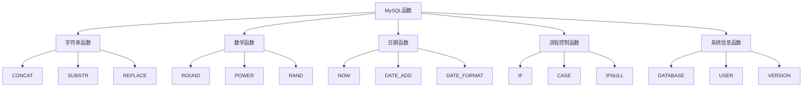

# ⚙️ MySQL 函数详解




---

## 🎯 1. 字符串函数

### 1.1 连接与长度函数
```sql
-- 字符串连接
SELECT CONCAT('Hello', ' ', 'MySQL');                    -- 'Hello MySQL'
SELECT CONCAT_WS('-', '2024', '12', '19');               -- '2024-12-19'

-- 字符串长度
SELECT LENGTH('MySQL');                                  -- 5（字节数）
SELECT CHAR_LENGTH('MySQL');                             -- 5（字符数）

-- 中文字符长度演示
SELECT LENGTH('中文'), CHAR_LENGTH('中文');               -- 6, 2
```

### 1.2 大小写转换
```sql
SELECT UPPER('mysql');                                    -- 'MYSQL'
SELECT LOWER('MYSQL');                                    -- 'mysql'
SELECT UCASE('mysql'), LCASE('MYSQL');                    -- 同上
```

### 1.3 子串操作
```sql
-- 提取子串
SELECT SUBSTR('MySQL', 2, 3);                            -- 'ySQ'
SELECT SUBSTRING('MySQL', 2, 3);                         -- 'ySQ'
SELECT LEFT('MySQL', 2);                                 -- 'My'
SELECT RIGHT('MySQL', 3);                                -- 'SQL'

-- 字符串定位
SELECT INSTR('MySQL', 'SQL');                            -- 3
SELECT LOCATE('SQL', 'MySQL');                           -- 3
```

### 1.4 填充与修剪
```sql
-- 字符串填充
SELECT LPAD('5', 3, '0');                                -- '005'
SELECT RPAD('5', 3, '0');                                -- '500'

-- 去除空格
SELECT TRIM('  MySQL  ');                                -- 'MySQL'
SELECT LTRIM('  MySQL');                                 -- 'MySQL'
SELECT RTRIM('MySQL  ');                                 -- 'MySQL'
```

### 1.5 替换与格式化
```sql
-- 字符串替换
SELECT REPLACE('MySQL', 'SQL', 'Database');              -- 'MyDatabase'

-- 重复字符串
SELECT REPEAT('*', 5);                                   -- '*****'

-- 反转字符串
SELECT REVERSE('MySQL');                                 -- 'LQSyM'
```

## 🎯 2. 数学函数

### 2.1 基本数学运算
```sql
-- 绝对值
SELECT ABS(-10);                                         -- 10

-- 取整函数
SELECT CEIL(3.14);                                       -- 4
SELECT FLOOR(3.14);                                      -- 3
SELECT ROUND(3.456, 2);                                  -- 3.46

-- 符号函数
SELECT SIGN(-5), SIGN(0), SIGN(5);                       -- -1, 0, 1
```

### 2.2 幂运算与对数
```sql
-- 幂运算
SELECT POWER(2, 3);                                      -- 8
SELECT SQRT(16);                                         -- 4

-- 对数函数
SELECT LOG(2, 8);                                        -- 3
SELECT LN(2.71828);                                      -- 约等于1
```

### 2.3 三角函数
```sql
-- 三角函数
SELECT SIN(PI()/2);                                      -- 1
SELECT COS(PI());                                        -- -1
SELECT TAN(PI()/4);                                      -- 约等于1

-- 角度弧度转换
SELECT DEGREES(PI());                                    -- 180
SELECT RADIANS(180);                                     -- π
```

### 2.4 随机数与进制转换
```sql
-- 随机数
SELECT RAND();                                           -- 0~1随机数
SELECT RAND() * 100;                                     -- 0~100随机数

-- 进制转换
SELECT BIN(10);                                          -- '1010'
SELECT OCT(10);                                          -- '12'
SELECT HEX(255);                                         -- 'FF'
```

## 🎯 3. 日期时间函数

### 3.1 获取当前时间
```sql
-- 当前日期时间
SELECT NOW();                                            -- 2024-12-19 15:30:45
SELECT SYSDATE();                                        -- 同上
SELECT CURRENT_TIMESTAMP();                              -- 同上

-- 当前日期和时间
SELECT CURDATE();                                        -- 2024-12-19
SELECT CURRENT_DATE();                                   -- 同上
SELECT CURTIME();                                        -- 15:30:45
SELECT CURRENT_TIME();                                   -- 同上
```

### 3.2 日期提取函数
```sql
-- 提取日期部分
SELECT YEAR('2024-12-19');                               -- 2024
SELECT MONTH('2024-12-19');                              -- 12
SELECT DAY('2024-12-19');                                -- 19

-- 提取时间部分
SELECT HOUR('15:30:45');                                 -- 15
SELECT MINUTE('15:30:45');                               -- 30
SELECT SECOND('15:30:45');                               -- 45

-- 星期相关
SELECT DAYNAME('2024-12-19');                            -- 'Thursday'
SELECT DAYOFWEEK('2024-12-19');                          -- 5
SELECT WEEK('2024-12-19');                               -- 51
```

### 3.3 日期计算函数
```sql
-- 日期加减
SELECT DATE_ADD('2024-12-19', INTERVAL 1 DAY);           -- 2024-12-20
SELECT DATE_SUB('2024-12-19', INTERVAL 1 MONTH);         -- 2024-11-19

-- 日期差值
SELECT DATEDIFF('2024-12-31', '2024-12-19');             -- 12
SELECT TIMEDIFF('15:30:45', '14:30:45');                 -- 01:00:00
```

### 3.4 日期格式化
```sql
-- 日期格式化
SELECT DATE_FORMAT(NOW(), '%Y-%m-%d %H:%i:%s');          -- 2024-12-19 15:30:45
SELECT DATE_FORMAT(NOW(), '%Y年%m月%d日');               -- 2024年12月19日

-- 字符串转日期
SELECT STR_TO_DATE('2024-12-19', '%Y-%m-%d');            -- 2024-12-19
```

## 🎯 4. 流程控制函数

### 4.1 条件判断函数
```sql
-- IF函数
SELECT IF(age > 18, '成年', '未成年') FROM students;

-- CASE WHEN
SELECT name,
       CASE 
           WHEN age < 18 THEN '未成年'
           WHEN age BETWEEN 18 AND 22 THEN '青年'
           ELSE '成年'
       END AS age_group
FROM students;
```

### 4.2 空值处理函数
```sql
-- 处理NULL值
SELECT IFNULL(email, '未填写') FROM students;
SELECT COALESCE(email, phone, '无联系方式') FROM students;

-- NULL判断
SELECT NULLIF(age, 0) FROM students;  -- 如果age=0返回NULL，否则返回age
```

## 🎯 5. 系统信息函数

### 5.1 数据库信息
```sql
-- 数据库信息
SELECT DATABASE();                                       -- 当前数据库
SELECT USER();                                           -- 当前用户
SELECT VERSION();                                        -- MySQL版本

-- 连接信息
SELECT CONNECTION_ID();                                  -- 连接ID
```

### 5.2 系统状态函数
```sql
-- 最后插入ID
SELECT LAST_INSERT_ID();                                 -- 最后插入的自增ID

-- 影响行数
SELECT ROW_COUNT();                                      -- 上条语句影响行数
```

## 🎯 6. 聚合函数补充

### 6.1 高级聚合函数
```sql
-- 统计函数
SELECT COUNT(DISTINCT gender) FROM students;             -- 不同性别数量

-- 分组拼接
SELECT GROUP_CONCAT(name) FROM students GROUP BY gender; -- 同性别名字拼接

-- 方差和标准差
SELECT VARIANCE(age) FROM students;                      -- 年龄方差
SELECT STDDEV(age) FROM students;                        -- 年龄标准差
```

## 🎯 7. 函数使用最佳实践

### 7.1 性能优化建议
```sql
-- 避免在WHERE条件中使用函数（无法使用索引）
SELECT * FROM students WHERE YEAR(birthday) = 2024;      -- ❌ 不推荐
SELECT * FROM students WHERE birthday >= '2024-01-01' 
AND birthday < '2025-01-01';                             -- ✅ 推荐

-- 使用函数索引
CREATE INDEX idx_name_lower ON students(LOWER(name));
```

### 7.2 函数组合使用
```sql
-- 函数嵌套使用
SELECT UPPER(CONCAT(LEFT(name, 1), '.', SUBSTRING(name, 2))) 
FROM students;

-- 复杂日期处理
SELECT DATE_FORMAT(DATE_ADD(birthday, INTERVAL 18 YEAR), '%Y年%m月%d日')
FROM students;
```

## 💡 8. 实战应用示例

### 8.1 字符串处理实战
```sql
-- 格式化电话号码
SELECT 
    name,
    CONCAT(
        '+86 ',
        LEFT(phone, 3),
        '-',
        SUBSTRING(phone, 4, 4),
        '-',
        RIGHT(phone, 4)
    ) AS formatted_phone
FROM users;
```

### 8.2 日期处理实战
```sql
-- 计算年龄
SELECT 
    name,
    birthday,
    TIMESTAMPDIFF(YEAR, birthday, CURDATE()) AS age
FROM students;

-- 本月生日的人
SELECT name, birthday
FROM students
WHERE MONTH(birthday) = MONTH(CURDATE());
```

### 8.3 数据清洗实战
```sql
-- 清理和格式化数据
UPDATE users 
SET 
    email = LOWER(TRIM(email)),
    phone = REPLACE(phone, ' ', ''),
    name = CONCAT(UPPER(LEFT(name, 1)), LOWER(SUBSTRING(name, 2)))
WHERE id = 1;
```

---

**📌 下一部分预告**：MySQL 约束与表关系设计

> 🚀 函数是 SQL 的瑞士军刀，熟练掌握各种函数能让你的数据操作如虎添翼！多练习实际场景中的应用，让这些函数成为你的得力助手～
