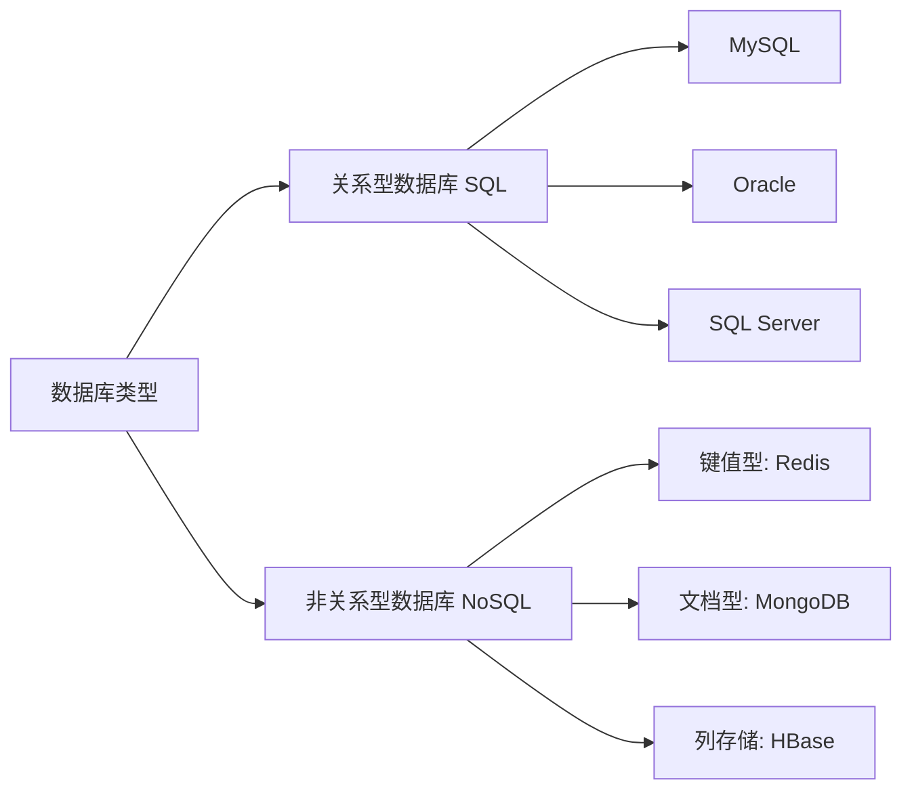

# 🗃️ MySQL 基础篇

## 📌 1. 数据库概述

> 🎯 **核心概念**：数据库（Database）是“按照数据结构来组织、存储和管理数据的仓库”，是一个长期存储在计算机内的、有组织的、可共享的、统一管理的大量数据的集合。

### 1.1 数据库分类


### 1.2 SQL 语言分类
| 类型 | 全称 | 说明 | 主要命令 |
| :--- | :--- | :--- | :--- |
| **DDL** | Data Definition Language | 数据定义语言 | `CREATE`, `DROP`, `ALTER` |
| **DML** | Data Manipulation Language | 数据操作语言 | `INSERT`, `DELETE`, `UPDATE` |
| **DQL** | Data Query Language | 数据查询语言 | `SELECT` |
| **DCL** | Data Control Language | 数据控制语言 | `GRANT`, `REVOKE` |

> 💡 **记忆技巧**：DDL-定义结构，DML-操作数据，DQL-查询数据，DCL-控制权限

---

## ⚙️ 2. MySQL 安装与配置

### 2.1 Windows 安装流程
1. 下载 MySQL Installer
2. 选择安装类型：**Developer Default**（开发默认）
3. 检查需求 → 执行安装
4. 产品配置：设置 **root 密码** 和创建用户
5. 配置 Windows 服务（建议开机自启）
6. 使用 **MySQL Workbench** 验证连接

### 2.2 环境变量配置
将 MySQL 的 `bin` 目录路径添加到系统环境变量 `Path` 中，实现命令行全局调用 `mysql` 命令。

> ⚠️ **注意**：配置后需重启命令行工具生效。

---

## 🏗️ 3. DDL：数据定义语言

### 3.1 数据库操作
```sql
-- 创建数据库（判断不存在再创建）
CREATE DATABASE IF NOT EXISTS school;

-- 使用/切换数据库
USE school;

-- 查看所有数据库
SHOW DATABASES;

-- 删除数据库（判断存在再删除）
DROP DATABASE IF EXISTS school;
```

### 3.2 数据类型
| 分类 | 常用类型 | 描述 | 范围/示例 |
| :--- | :--- | :--- | :--- |
| **数值** | `INT` | 整数 | -2^31 ~ 2^31-1 |
| | `DOUBLE` | 双精度浮点数 | 小数 |
| | `DECIMAL(M,D)` | 精确小数 | M总位数，D小数位 |
| **文本** | `CHAR(n)` | 定长字符串 | n=0~255 |
| | `VARCHAR(n)` | 变长字符串 | n=0~65535 |
| | `TEXT` | 长文本数据 |  |
| **日期** | `DATE` | 日期 | YYYY-MM-DD |
| | `DATETIME` | 日期时间 | YYYY-MM-DD HH:MM:SS |
| | `TIMESTAMP` | 时间戳 | 自动记录修改时间 |

> 🎯 **重点区别**：`CHAR` 定长效率高，`VARCHAR` 变长省空间。

### 3.3 表操作
```sql
-- 创建表
CREATE TABLE students (
    id INT PRIMARY KEY AUTO_INCREMENT,    -- 主键自增
    name VARCHAR(20) NOT NULL,            -- 非空
    age INT,
    gender ENUM('男', '女'),
    birthday DATE
);

-- 查看表结构
DESC students;

-- 修改表：添加字段
ALTER TABLE students ADD COLUMN email VARCHAR(50);

-- 修改表：修改字段类型
ALTER TABLE students MODIFY COLUMN name VARCHAR(30);

-- 修改表：删除字段
ALTER TABLE students DROP COLUMN email;

-- 删除表
DROP TABLE IF EXISTS students;
```

---

## 📥 4. DML：数据操作语言

### 4.1 插入数据
```sql
-- 方式1：插入完整数据（需与字段顺序一致）
INSERT INTO students 
VALUES (1, '张三', 18, '男', '2005-03-15');

-- 方式2：插入指定字段数据（推荐）
INSERT INTO students (name, age, gender) 
VALUES ('李四', 19, '女');

-- 方式3：批量插入
INSERT INTO students (name, age, gender) VALUES
('王五', 20, '男'),
('赵六', 21, '女');
```

### 4.2 更新数据
```sql
-- 更新所有行（慎用！）
UPDATE students SET age = 20;

-- 条件更新
UPDATE students 
SET age = 22, email = 'lisi@example.com' 
WHERE name = '李四';
```

> ⚠️ **警告**：执行 UPDATE 和 DELETE 前务必先写 WHERE 条件，避免误操作全表！

### 4.3 删除数据
```sql
-- 条件删除
DELETE FROM students WHERE id = 3;

-- 删除全表数据（可回滚）
DELETE FROM students;

-- 清空表（不可回滚，效率高）
TRUNCATE TABLE students;
```

---
