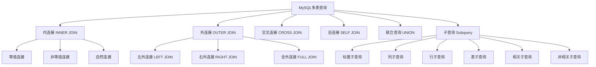

# 🔗 MySQL 多表查询与连接操作


---

## 🎯 1. 连接查询基础

### 1.1 连接查询概念
连接查询是将多个表中的数据按照某种条件组合在一起的操作，是关系型数据库的核心功能。

### 1.2 连接类型概述
```sql
-- 内连接：只返回匹配的行
SELECT * FROM table1 INNER JOIN table2 ON condition;

-- 左外连接：返回左表所有行，右表匹配的行
SELECT * FROM table1 LEFT JOIN table2 ON condition;

-- 右外连接：返回右表所有行，左表匹配的行  
SELECT * FROM table1 RIGHT JOIN table2 ON condition;

-- 全外连接：返回左右表所有行（MySQL不支持，用UNION模拟）
SELECT * FROM table1 LEFT JOIN table2 ON condition
UNION
SELECT * FROM table1 RIGHT JOIN table2 ON condition;
```

## 🎯 2. 内连接 (INNER JOIN)

### 2.1 等值连接
```sql
-- 基本内连接
SELECT employees.name, departments.dept_name
FROM employees
INNER JOIN departments ON employees.dept_id = departments.dept_id;

-- 使用WHERE子句的旧式写法
SELECT employees.name, departments.dept_name
FROM employees, departments
WHERE employees.dept_id = departments.dept_id;

-- 多表内连接
SELECT e.name, d.dept_name, p.project_name
FROM employees e
INNER JOIN departments d ON e.dept_id = d.dept_id
INNER JOIN projects p ON e.emp_id = p.manager_id;
```

### 2.2 非等值连接
```sql
-- 工资等级查询
SELECT e.name, e.salary, g.grade_level
FROM employees e
INNER JOIN grade_levels g 
ON e.salary BETWEEN g.min_salary AND g.max_salary;

-- 日期范围连接
SELECT o.order_id, c.campaign_name
FROM orders o
INNER JOIN campaigns c 
ON o.order_date BETWEEN c.start_date AND c.end_date;
```

### 2.3 自然连接 (NATURAL JOIN)
```sql
-- 自动匹配相同列名
SELECT *
FROM employees
NATURAL JOIN departments;

-- 等价于
SELECT *
FROM employees
INNER JOIN departments 
USING (dept_id);
```

## 🎯 3. 外连接 (OUTER JOIN)

### 3.1 左外连接 (LEFT JOIN)
```sql
-- 查询所有员工及其部门（包括无部门员工）
SELECT e.name, d.dept_name
FROM employees e
LEFT JOIN departments d ON e.dept_id = d.dept_id;

-- 查找没有部门的员工
SELECT e.name
FROM employees e
LEFT JOIN departments d ON e.dept_id = d.dept_id
WHERE d.dept_id IS NULL;

-- 多表左连接
SELECT e.name, d.dept_name, p.project_name
FROM employees e
LEFT JOIN departments d ON e.dept_id = d.dept_id
LEFT JOIN projects p ON e.emp_id = p.manager_id;
```

### 3.2 右外连接 (RIGHT JOIN)
```sql
-- 查询所有部门及其员工（包括无员工部门）
SELECT d.dept_name, e.name
FROM employees e
RIGHT JOIN departments d ON e.dept_id = d.dept_id;

-- 查找没有员工的部门
SELECT d.dept_name
FROM employees e
RIGHT JOIN departments d ON e.dept_id = d.dept_id
WHERE e.emp_id IS NULL;
```

### 3.3 全外连接模拟 (FULL JOIN)
```sql
-- MySQL模拟全外连接
SELECT e.name, d.dept_name
FROM employees e
LEFT JOIN departments d ON e.dept_id = d.dept_id
UNION
SELECT e.name, d.dept_name
FROM employees e
RIGHT JOIN departments d ON e.dept_id = d.dept_id;
```

## 🎯 4. 交叉连接 (CROSS JOIN)

### 4.1 笛卡尔积
```sql
-- 显式交叉连接
SELECT e.name, d.dept_name
FROM employees e
CROSS JOIN departments d;

-- 隐式交叉连接（不推荐）
SELECT e.name, d.dept_name
FROM employees e, departments d;

-- 实际应用：生成测试数据
SELECT p.product_name, s.size_name, c.color_name
FROM products p
CROSS JOIN sizes s
CROSS JOIN colors c;
```

## 🎯 5. 自连接 (SELF JOIN)

### 5.1 自连接应用
```sql
-- 员工及其经理关系
SELECT e1.name AS employee_name, e2.name AS manager_name
FROM employees e1
LEFT JOIN employees e2 ON e1.manager_id = e2.emp_id;

-- 查找同一部门的员工对
SELECT e1.name AS employee1, e2.name AS employee2
FROM employees e1
INNER JOIN employees e2 ON e1.dept_id = e2.dept_id
WHERE e1.emp_id < e2.emp_id;

-- 层级关系查询
SELECT e1.name, e2.name, e3.name
FROM employees e1
LEFT JOIN employees e2 ON e1.manager_id = e2.emp_id
LEFT JOIN employees e3 ON e2.manager_id = e3.emp_id;
```

## 🎯 6. 联合查询 (UNION)

### 6.1 UNION 操作
```sql
-- 合并两个查询结果（去重）
SELECT name FROM current_employees
UNION
SELECT name FROM former_employees;

-- 合并结果（不去重）
SELECT name FROM current_employees
UNION ALL
SELECT name FROM former_employees;

-- 多表联合查询
SELECT 'Employee' AS type, name, hire_date AS date FROM employees
UNION ALL
SELECT 'Customer' AS type, cust_name, reg_date FROM customers
ORDER BY date DESC;
```

### 6.2 UNION 使用规则
```sql
-- 列数和类型必须匹配
SELECT emp_id, name FROM employees
UNION
SELECT cust_id, cust_name FROM customers;

-- 使用NULL填充不匹配的列
SELECT emp_id, name, NULL AS order_date FROM employees
UNION
SELECT NULL, cust_name, order_date FROM customers;
```

## 🎯 7. 子查询 (Subquery)

### 7.1 标量子查询
```sql
-- 返回单个值的子查询
SELECT name, salary,
       (SELECT AVG(salary) FROM employees) AS avg_salary
FROM employees;

-- 在WHERE中使用
SELECT name, salary
FROM employees
WHERE salary > (SELECT AVG(salary) FROM employees);

-- 在SELECT中使用
SELECT dept_name,
       (SELECT COUNT(*) FROM employees e WHERE e.dept_id = d.dept_id) AS emp_count
FROM departments d;
```

### 7.2 列子查询
```sql
-- IN 操作符
SELECT name
FROM employees
WHERE dept_id IN (SELECT dept_id FROM departments WHERE location = '北京');

-- NOT IN 操作符
SELECT name
FROM employees
WHERE dept_id NOT IN (SELECT dept_id FROM departments WHERE budget < 100000);

-- ANY/SOME 操作符
SELECT name, salary
FROM employees
WHERE salary > ANY (SELECT salary FROM employees WHERE dept_id = 1);

-- ALL 操作符
SELECT name, salary
FROM employees
WHERE salary > ALL (SELECT salary FROM employees WHERE dept_id = 1);
```

### 7.3 行子查询
```sql
-- 多列比较
SELECT name, dept_id, salary
FROM employees
WHERE (dept_id, salary) IN (
    SELECT dept_id, MAX(salary)
    FROM employees
    GROUP BY dept_id
);

-- 行构造器比较
SELECT *
FROM employees
WHERE (dept_id, hire_date) = (1, '2023-01-01');
```

### 7.4 表子查询
```sql
-- FROM子句中的子查询
SELECT dept_name, emp_count
FROM (
    SELECT d.dept_name, COUNT(e.emp_id) AS emp_count
    FROM departments d
    LEFT JOIN employees e ON d.dept_id = e.dept_id
    GROUP BY d.dept_id
) AS dept_stats
WHERE emp_count > 5;

-- 作为临时表连接
SELECT e.name, ds.avg_salary
FROM employees e
INNER JOIN (
    SELECT dept_id, AVG(salary) AS avg_salary
    FROM employees
    GROUP BY dept_id
) AS ds ON e.dept_id = ds.dept_id;
```

### 7.5 相关子查询
```sql
--  EXISTS 操作符
SELECT dept_name
FROM departments d
WHERE EXISTS (
    SELECT 1
    FROM employees e
    WHERE e.dept_id = d.dept_id AND e.salary > 50000
);

-- NOT EXISTS 操作符
SELECT dept_name
FROM departments d
WHERE NOT EXISTS (
    SELECT 1
    FROM employees e
    WHERE e.dept_id = d.dept_id
);

-- 相关更新
UPDATE employees e
SET salary = salary * 1.1
WHERE salary < (SELECT AVG(salary) FROM employees WHERE dept_id = e.dept_id);
```

## 🎯 8. 连接查询性能优化

### 8.1 索引优化
```sql
-- 为连接字段创建索引
CREATE INDEX idx_dept_id ON employees(dept_id);
CREATE INDEX idx_emp_id ON projects(manager_id);

-- 覆盖索引
CREATE INDEX idx_emp_dept_salary ON employees(dept_id, salary);
```

### 8.2 查询优化技巧
```sql
-- 使用EXISTS代替IN
SELECT dept_name
FROM departments d
WHERE EXISTS (
    SELECT 1 FROM employees e WHERE e.dept_id = d.dept_id
);

-- 避免在连接条件中使用函数
SELECT * 
FROM employees e
INNER JOIN departments d ON e.dept_id = d.dept_id  -- ✅ 好
WHERE YEAR(e.hire_date) = 2023;                    -- ❌ 不好

-- 使用LIMIT限制结果集
SELECT e.name, d.dept_name
FROM employees e
INNER JOIN departments d ON e.dept_id = d.dept_id
LIMIT 100;
```

### 8.3 执行计划分析
```sql
-- 查看执行计划
EXPLAIN 
SELECT e.name, d.dept_name
FROM employees e
INNER JOIN departments d ON e.dept_id = d.dept_id;

-- 分析连接性能
EXPLAIN ANALYZE
SELECT e.name, d.dept_name
FROM employees e
LEFT JOIN departments d ON e.dept_id = d.dept_id;
```

## 🎯 9. 实战综合案例

### 9.1 复杂业务查询
```sql
-- 查询每个部门工资最高的员工
SELECT d.dept_name, e.name, e.salary
FROM employees e
INNER JOIN departments d ON e.dept_id = d.dept_id
INNER JOIN (
    SELECT dept_id, MAX(salary) AS max_salary
    FROM employees
    GROUP BY dept_id
) AS max_sal ON e.dept_id = max_sal.dept_id AND e.salary = max_sal.max_salary;

-- 查询没有项目的员工
SELECT e.name, d.dept_name
FROM employees e
LEFT JOIN departments d ON e.dept_id = d.dept_id
WHERE NOT EXISTS (
    SELECT 1 FROM projects p WHERE p.manager_id = e.emp_id
);

-- 层级组织架构查询
WITH RECURSIVE org_chart AS (
    -- 锚点查询：顶级管理者
    SELECT emp_id, name, manager_id, 1 AS level
    FROM employees
    WHERE manager_id IS NULL
    
    UNION ALL
    
    -- 递归查询：下属员工
    SELECT e.emp_id, e.name, e.manager_id, oc.level + 1
    FROM employees e
    INNER JOIN org_chart oc ON e.manager_id = oc.emp_id
)
SELECT * FROM org_chart ORDER BY level, name;
```

### 9.2 报表统计查询
```sql
-- 部门统计报表
SELECT 
    d.dept_name,
    COUNT(e.emp_id) AS total_employees,
    AVG(e.salary) AS avg_salary,
    MAX(e.salary) AS max_salary,
    MIN(e.salary) AS min_salary,
    SUM(CASE WHEN e.hire_date >= '2023-01-01' THEN 1 ELSE 0 END) AS new_hires
FROM departments d
LEFT JOIN employees e ON d.dept_id = e.dept_id
GROUP BY d.dept_id
ORDER BY total_employees DESC;

-- 员工项目参与情况
SELECT 
    e.name,
    d.dept_name,
    COUNT(p.project_id) AS project_count,
    GROUP_CONCAT(p.project_name) AS projects
FROM employees e
LEFT JOIN departments d ON e.dept_id = d.dept_id
LEFT JOIN project_members pm ON e.emp_id = pm.emp_id
LEFT JOIN projects p ON pm.project_id = p.project_id
GROUP BY e.emp_id
HAVING project_count > 0;
```

## 💡 10. 常见问题与解决方案

### 10.1 性能问题处理
```sql
-- 大表连接优化：分段处理
SELECT * 
FROM large_table1 l1
INNER JOIN large_table2 l2 ON l1.id = l2.id
WHERE l1.create_date >= '2023-01-01'
LIMIT 1000;

-- 使用临时表优化复杂查询
CREATE TEMPORARY TABLE temp_dept_stats AS
SELECT dept_id, COUNT(*) AS emp_count, AVG(salary) AS avg_salary
FROM employees
GROUP BY dept_id;

SELECT d.dept_name, t.emp_count, t.avg_salary
FROM departments d
INNER JOIN temp_dept_stats t ON d.dept_id = t.dept_id;
```

### 10.2 数据一致性问题
```sql
-- 检查连接完整性
SELECT e.emp_id, e.name, e.dept_id
FROM employees e
LEFT JOIN departments d ON e.dept_id = d.dept_id
WHERE d.dept_id IS NULL AND e.dept_id IS NOT NULL;

-- 修复数据不一致
UPDATE employees e
SET dept_id = NULL
WHERE NOT EXISTS (
    SELECT 1 FROM departments d WHERE d.dept_id = e.dept_id
) AND e.dept_id IS NOT NULL;
```

> 🚀 多表查询是SQL的核心技能，掌握各种连接方式和子查询技巧，能够让你轻松处理复杂的数据关系！记得多练习实际业务场景，熟能生巧～

