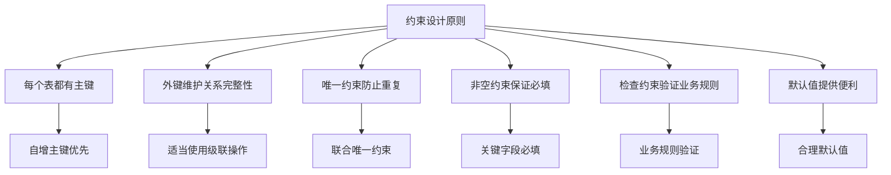
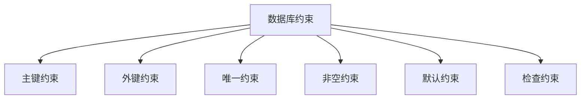

# 🔗 MySQL 约束与表关系设计

---

## 🎯 1. 约束概述

### 1.1 什么是约束
约束是用于限制表中数据的规则，确保数据的准确性和可靠性。



### 1.2 约束的作用
- ✅ **数据完整性**：保证数据的准确性和一致性
- ✅ **业务规则**：强制执行业务逻辑
- ✅ **数据质量**：防止无效数据插入
- ✅ **关系维护**：维护表之间的关联关系

## 🎯 2. 主键约束 (PRIMARY KEY)

### 2.1 主键特性
```sql
-- 创建表时定义主键
CREATE TABLE students (
    id INT PRIMARY KEY,                  -- 列级约束
    name VARCHAR(20) NOT NULL,
    age INT
);

-- 表级约束方式
CREATE TABLE students (
    id INT,
    name VARCHAR(20),
    age INT,
    PRIMARY KEY (id)                     -- 表级约束
);

-- 联合主键
CREATE TABLE course_selection (
    student_id INT,
    course_id INT,
    score INT,
    PRIMARY KEY (student_id, course_id)  -- 联合主键
);
```

### 2.2 主键操作
```sql
-- 添加主键约束
ALTER TABLE students ADD PRIMARY KEY (id);

-- 删除主键约束
ALTER TABLE students DROP PRIMARY KEY;

-- 自增主键
CREATE TABLE users (
    id INT AUTO_INCREMENT PRIMARY KEY,   -- 自增主键
    username VARCHAR(50) NOT NULL
);
```

> 💡 **主键最佳实践**：
> - 每个表都应该有一个主键
> - 主键值应该唯一且不为NULL
> - 优先使用自增整数作为主键
> - 避免使用业务字段作为主键

## 🎯 3. 外键约束 (FOREIGN KEY)

### 3.1 外键基础
```sql
-- 创建外键约束
CREATE TABLE orders (
    order_id INT PRIMARY KEY,
    customer_id INT,
    order_date DATE,
    FOREIGN KEY (customer_id) REFERENCES customers(customer_id)
);

-- 详细外键语法
CREATE TABLE orders (
    order_id INT PRIMARY KEY,
    customer_id INT,
    FOREIGN KEY (customer_id) 
        REFERENCES customers(customer_id)
        ON DELETE CASCADE                -- 删除时级联
        ON UPDATE CASCADE                -- 更新时级联
);
```

### 3.2 外键操作
```sql
-- 添加外键约束
ALTER TABLE orders 
ADD FOREIGN KEY (customer_id) 
REFERENCES customers(customer_id);

-- 删除外键约束
ALTER TABLE orders DROP FOREIGN KEY fk_customer;

-- 查看外键信息
SHOW CREATE TABLE orders;
```

### 3.3 外键引用动作
| 动作类型 | 说明 | 示例 |
| :--- | :--- | :--- |
| `CASCADE` | 级联操作 | 主表删除，从表也删除 |
| `SET NULL` | 设为NULL | 主表删除，从表外键设为NULL |
| `RESTRICT` | 限制操作 | 阻止主表变更（默认） |
| `NO ACTION` | 无动作 | 同RESTRICT |
| `SET DEFAULT` | 设默认值 | 主表删除，从表外键设默认值 |

## 🎯 4. 唯一约束 (UNIQUE)

### 4.1 唯一约束使用
```sql
-- 列级唯一约束
CREATE TABLE users (
    id INT PRIMARY KEY,
    email VARCHAR(100) UNIQUE,           -- 唯一约束
    username VARCHAR(50) UNIQUE
);

-- 表级唯一约束
CREATE TABLE users (
    id INT PRIMARY KEY,
    email VARCHAR(100),
    username VARCHAR(50),
    UNIQUE (email),                      -- 单列唯一
    UNIQUE (username)                   
);

-- 联合唯一约束
CREATE TABLE user_phones (
    user_id INT,
    phone_type VARCHAR(20),
    phone_number VARCHAR(20),
    UNIQUE (user_id, phone_type)         -- 联合唯一
);
```

### 4.2 唯一约束操作
```sql
-- 添加唯一约束
ALTER TABLE users ADD UNIQUE (email);
ALTER TABLE users ADD CONSTRAINT uk_username UNIQUE (username);

-- 删除唯一约束
ALTER TABLE users DROP INDEX uk_username;
```

## 🎯 5. 非空约束 (NOT NULL)

### 5.1 非空约束使用
```sql
-- 非空约束
CREATE TABLE employees (
    id INT PRIMARY KEY,
    name VARCHAR(100) NOT NULL,          -- 非空约束
    email VARCHAR(100) NOT NULL,
    hire_date DATE NOT NULL,
    salary DECIMAL(10,2)
);

-- 组合使用
CREATE TABLE products (
    product_id INT PRIMARY KEY,
    product_name VARCHAR(200) NOT NULL UNIQUE,
    price DECIMAL(10,2) NOT NULL CHECK (price > 0)
);
```

### 5.2 非空约束操作
```sql
-- 添加非空约束
ALTER TABLE employees MODIFY name VARCHAR(100) NOT NULL;

-- 移除非空约束
ALTER TABLE employees MODIFY name VARCHAR(100) NULL;
```

## 🎯 6. 默认约束 (DEFAULT)

### 6.1 默认值设置
```sql
-- 默认值约束
CREATE TABLE orders (
    order_id INT PRIMARY KEY,
    order_date DATE DEFAULT CURRENT_DATE,    -- 默认当前日期
    status VARCHAR(20) DEFAULT 'pending',    -- 默认状态
    total_amount DECIMAL(10,2) DEFAULT 0.00,
    created_at TIMESTAMP DEFAULT CURRENT_TIMESTAMP
);

-- 布尔值默认值
CREATE TABLE settings (
    user_id INT PRIMARY KEY,
    email_notifications BOOLEAN DEFAULT TRUE,
    sms_notifications BOOLEAN DEFAULT FALSE
);
```

### 6.2 默认值操作
```sql
-- 添加默认值
ALTER TABLE orders 
ALTER COLUMN status SET DEFAULT 'pending';

-- 删除默认值
ALTER TABLE orders 
ALTER COLUMN status DROP DEFAULT;
```

## 🎯 7. 检查约束 (CHECK)

### 7.1 检查约束使用
```sql
-- 检查约束
CREATE TABLE employees (
    id INT PRIMARY KEY,
    name VARCHAR(100) NOT NULL,
    age INT CHECK (age >= 18 AND age <= 65),      -- 年龄检查
    salary DECIMAL(10,2) CHECK (salary > 0),      -- 薪资检查
    email VARCHAR(100) CHECK (email LIKE '%@%')   -- 邮箱格式检查
);

-- 表级检查约束
CREATE TABLE products (
    product_id INT PRIMARY KEY,
    product_name VARCHAR(200),
    price DECIMAL(10,2),
    discount DECIMAL(5,2),
    CHECK (price > 0),                           -- 价格检查
    CHECK (discount >= 0 AND discount <= 1)      -- 折扣率检查
);
```

## 🎯 8. 表关系设计

### 8.1 一对一关系 (1:1)
```sql
-- 一对一关系示例
CREATE TABLE users (
    user_id INT PRIMARY KEY,
    username VARCHAR(50) UNIQUE NOT NULL,
    password_hash VARCHAR(255) NOT NULL
);

CREATE TABLE user_profiles (
    user_id INT PRIMARY KEY,
    full_name VARCHAR(100),
    birth_date DATE,
    avatar_url VARCHAR(255),
    FOREIGN KEY (user_id) REFERENCES users(user_id)
);
```

### 8.2 一对多关系 (1:N)
```sql
-- 一对多关系示例
CREATE TABLE departments (
    dept_id INT PRIMARY KEY,
    dept_name VARCHAR(100) NOT NULL
);

CREATE TABLE employees (
    emp_id INT PRIMARY KEY,
    emp_name VARCHAR(100) NOT NULL,
    dept_id INT,
    FOREIGN KEY (dept_id) REFERENCES departments(dept_id)
);
```

### 8.3 多对多关系 (N:M)
```sql
-- 多对多关系示例
CREATE TABLE students (
    student_id INT PRIMARY KEY,
    student_name VARCHAR(100) NOT NULL
);

CREATE TABLE courses (
    course_id INT PRIMARY KEY,
    course_name VARCHAR(100) NOT NULL
);

CREATE TABLE student_courses (
    student_id INT,
    course_id INT,
    enrollment_date DATE,
    grade DECIMAL(4,2),
    PRIMARY KEY (student_id, course_id),
    FOREIGN KEY (student_id) REFERENCES students(student_id),
    FOREIGN KEY (course_id) REFERENCES courses(course_id)
);
```

## 🎯 9. 约束管理实战

### 9.1 约束查询与监控
```sql
-- 查看表约束信息
SELECT * FROM information_schema.TABLE_CONSTRAINTS 
WHERE TABLE_NAME = 'orders';

-- 查看外键信息
SELECT * FROM information_schema.REFERENTIAL_CONSTRAINTS 
WHERE TABLE_NAME = 'orders';

-- 查看检查约束
SELECT * FROM information_schema.CHECK_CONSTRAINTS;
```

### 9.2 约束违规处理
```sql
-- 临时禁用外键检查
SET FOREIGN_KEY_CHECKS = 0;

-- 执行需要忽略外键的操作
DELETE FROM customers WHERE customer_id = 1;

-- 重新启用外键检查
SET FOREIGN_KEY_CHECKS = 1;

-- 处理约束错误
INSERT INTO orders (order_id, customer_id) 
VALUES (1001, 999) 
ON DUPLICATE KEY UPDATE customer_id = VALUES(customer_id);
```

### 9.3 数据完整性检查
```sql
-- 检查外键完整性
SELECT o.order_id, o.customer_id, c.customer_name
FROM orders o
LEFT JOIN customers c ON o.customer_id = c.customer_id
WHERE c.customer_id IS NULL;

-- 检查唯一约束违规
SELECT email, COUNT(*) 
FROM users 
GROUP BY email 
HAVING COUNT(*) > 1;

-- 检查非空约束
SELECT * FROM employees WHERE name IS NULL;
```

## 💡 10. 设计最佳实践

### 10.1 命名规范
```sql
-- 约束命名规范
CREATE TABLE employees (
    emp_id INT,
    dept_id INT,
    CONSTRAINT pk_employees PRIMARY KEY (emp_id),
    CONSTRAINT fk_emp_dept FOREIGN KEY (dept_id) REFERENCES departments(dept_id),
    CONSTRAINT uk_emp_email UNIQUE (email),
    CONSTRAINT ck_emp_age CHECK (age >= 18)
);
```

### 10.2 性能考虑
```sql
-- 为外键字段创建索引
CREATE INDEX idx_dept_id ON employees(dept_id);

-- 避免过多的外键约束（在读写频繁的表上）
-- 考虑应用层维护数据完整性

-- 使用适当的引用动作
FOREIGN KEY (dept_id) REFERENCES departments(dept_id)
ON DELETE SET NULL ON UPDATE CASCADE;
```

### 10.3 数据迁移中的约束处理
```sql
-- 迁移时临时禁用约束
SET FOREIGN_KEY_CHECKS = 0;
SET UNIQUE_CHECKS = 0;

-- 执行数据迁移操作
INSERT INTO new_table SELECT * FROM old_table;

-- 重新启用约束
SET FOREIGN_KEY_CHECKS = 1;
SET UNIQUE_CHECKS = 1;

-- 验证数据完整性
ANALYZE TABLE new_table;
```

---

MySQL 多表查询与连接操作

> 🚀 良好的约束设计是数据库健康的基石！合理使用约束可以大大减少数据质量问题，让你的数据库更加健壮可靠。记住：约束越严格，数据越干净！
