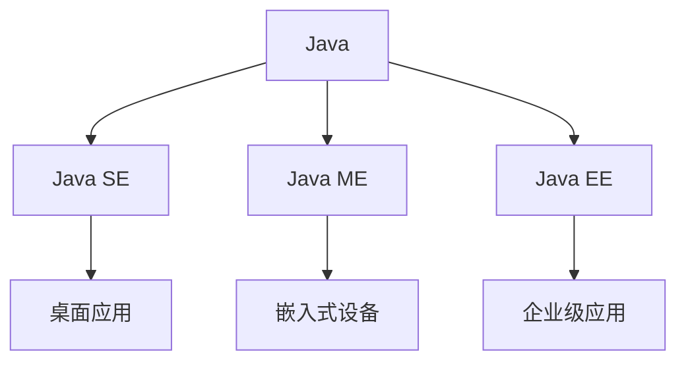
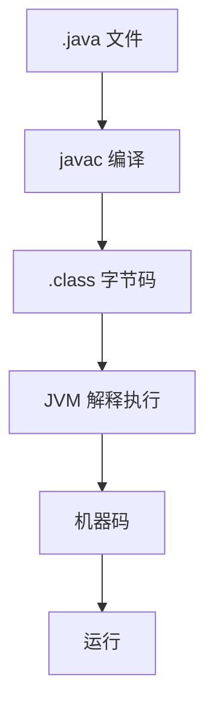

---

# 🚀 JavaSE 入门笔记

## 📜 一、Java 的历史与背景

### 1.1 诞生背景
- **C语言统治时期**：
	- 优点：贴近硬件， 运行极快， 效率极高
	- 缺点：指针和内存管理复杂，易出错，移植性差（多平台上明显，需要手动写一份）
- **Java的诞生**：由 James Gosling 等人开发，初衷是打造一门**简单、安全、可移植、面向对象**的语言。
- **命名由来**：最初叫 Oak（橡树），后改为 Java（灵感来源于咖啡）。

### 1.2 Java 的成功因素
- **跨平台性**（JVM）
- **面向互联网**（Applet）图形界面的程序
- **企业级支持**（J2EE）
- **开源生态**（Spring, Hibernate, Maven, etc.）

> [!note]
> 借助JVM 实现 “一次编写，随处运行”：“write once, run anywhere”


---

## 🧠 二、Java 的核心特性

| 特性       | 说明                               |
| -------- | -------------------------------- |
| **简单性**  | 无指针、无多重继承、语法类似 C                 |
| **面向对象** | 万物皆对象，支持封装、继承、多态                 |
| **跨平台性** | Write Once, Run Anywhere（依靠 JVM） |
| **高性能**  | JIT 即时编译，热点代码优化                  |
| **多线程**  | 内置支持，简化并发编程                      |
| **安全性**  | 字节码校验、沙箱机制                       |
| **动态性**  | 反射机制，运行时加载类                      |

---

## 📦 三、Java 三大版本



- **Java SE**：标准版，基础核心，**学习起点**（但是用来开发桌面应用就是个lj）
- **Java ME**：微缩版，嵌入式开发（逐渐边缘化） （乔布斯还没有开始重搞手机）
- **Java EE**：企业版，Web 和服务器开发（现称 Jakarta EE）*（简直是为写服务器端 程序所发明的！）*
	- <u>强大， 健壮， 安全， 简单， 跨平台（高可用，高性能，高并发</u>）
	- 除了商业巨头以外， 程序员们也会对Java王国 这么热爱， 他们基于Java 开发了巨多 的平台，系统，工具
		-  构建工具: Ant，Maven, Jekins 
		- 应用服务器： Tomcat，Jetty, Jboss, Websphere, weblogic 
		- Web开发： Struts,Spring,Hibernate, myBatis 
		- 开发工具： Eclipse, Netbean,intellij idea, Jbuilder

---

## ⚙️ 四、JDK 与 JRE

### 4.1 区别与联系
| 名称 | 全称 | 用途 | 包含内容 |
|------|------|------|----------|
| **JRE** | Java Runtime Environment | 运行 Java 程序 | JVM + 核心类库 |
| **JDK** | Java Development Kit | 开发 Java 程序 | JRE + 开发工具（javac, jar, javadoc等） |

### 4.2 JVM 工作机制


---

## 🛠️ 五、开发环境搭建

### 5.1 安装 JDK
1. 下载 JDK8（推荐稳定版）
2. 配置环境变量：
   - `JAVA_HOME`：JDK 安装路径
   - `Path`：添加 `%JAVA_HOME%\bin`

### 5.2 验证安装
```bash
java -version
javac -version
```

### 5.3 推荐编辑器
- **IntelliJ IDEA**（主流）
- VS Code + Java 扩展
- Eclipse（传统）

---

## 🌍 六、第一个 Java 程序：HelloWorld

```java
public class Hello {
    public static void main(String[] args) {
        System.out.println("Hello, World!");
    }
}
```

### 编译与运行：
```bash
javac Hello.java   # 编译生成 Hello.class
java Hello         # 运行程序
```

---

## 📘 七、Java 程序结构规范

- **类名**：大驼峰，与文件名一致
- **方法名**：小驼峰
- **主方法**：`public static void main(String[] args)`
- **大小写敏感** ，这块可以参照搜狗输入法的中文状态下输入英文符号（个人感觉中文的标点符号对应程序员来说不常用）
- **每句结尾加分号** `;`

---

## 🧩 八、Java 运行机制

- **混合型语言**：编译 + 解释
- **编译**：`.java` → `.class`（字节码）
- **解释执行**：JVM 逐行解释字节码为机器码

---

## ✅ 九、总结与建议

> 💡 学 Java 不仅要掌握语法，更要理解其**设计哲学**和**生态体系**。

### 学习建议：
- 多敲代码，多调试
- 理解面向对象思想
- 掌握常用类库和工具
- 跟进 Spring Boot、微服务等现代技术

---
