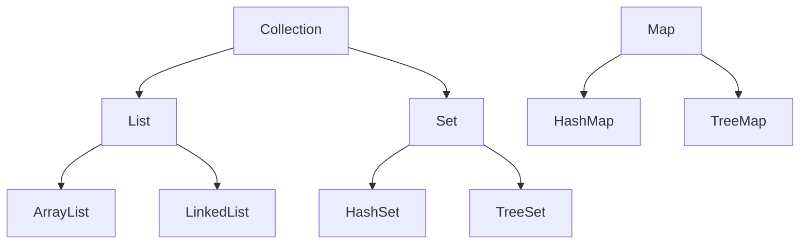
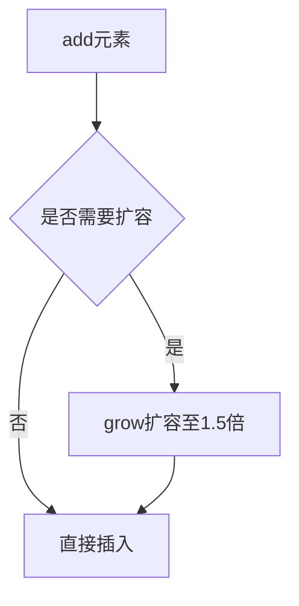

# 🗂 Java 集合框架（Collection Framework）

## 一、为什么使用集合？

- 数组长度固定，无法动态扩展
- 集合可动态扩容，提供丰富的数据结构和算法
- 适用于对象数量不确定或需要复杂存储结构的场景

---

## 二、集合框架结构

### 1. 接口层次图（思维导图）



### 2. 接口特点对比

| 接口      | 是否有序 | 是否唯一 | 实现类示例       |
| --------- | -------- | -------- | ---------------- |
| `List`    | ✅        | ❌        | ArrayList, LinkedList |
| `Set`     | ❌        | ✅        | HashSet, TreeSet     |
| `Map`     | ❌        | Key唯一  | HashMap, TreeMap     |

---

## 三、List 接口

### 1. ArrayList

- 基于动态数组，连续内存空间
- 适合随机访问，不适合频繁插入删除

#### 核心方法：

```java
List<String> list = new ArrayList<>();
list.add("A");
list.add(1, "B");
list.remove(0);
list.get(0);
list.size();
```

#### 扩容机制：



---

### 2. LinkedList

- 基于双向链表
- 适合频繁插入删除，不适合随机访问

#### 特殊方法：

```java
LinkedList<String> list = new LinkedList<>();
list.addFirst("A");
list.addLast("B");
list.removeFirst();
list.getLast();
```

---

## 四、Set 接口

### 1. HashSet

- 基于 HashMap 实现
- 无序，唯一，允许 null

### 2. TreeSet

- 基于红黑树
- 有序，唯一，不允许 null

---

## 五、Map 接口

### 1. HashMap

- 键值对存储，Key 唯一
- 基于数组 + 链表 / 红黑树（JDK8+）

#### 常用方法：

```java
Map<String, Integer> map = new HashMap<>();
map.put("key", 1);
map.get("key");
map.containsKey("key");
map.remove("key");
```

---

## 六、迭代器 Iterator

```java
Iterator<String> it = list.iterator();
while(it.hasNext()) {
    System.out.println(it.next());
}
```

---

## 七、泛型与集合

- 避免类型转换异常
- 编译时类型检查

```java
List<String> list = new ArrayList<>();
list.add("hello");
// list.add(123); // 编译错误
```

---

## 八、Collections 工具类

### 常用方法：

| 方法名                  | 说明             |
| ----------------------- | ---------------- |
| `sort(list)`            | 排序             |
| `reverse(list)`         | 反转             |
| `shuffle(list)`         | 随机打乱         |
| `synchronizedList(list)`| 返回线程安全列表 |

---

## 九、总结对比

### ArrayList vs LinkedList

| 特性         | ArrayList | LinkedList |
| ------------ | --------- | ---------- |
| 随机访问     | ⚡️ 快      | 🐢 慢       |
| 插入删除     | 🐢 慢      | ⚡️ 快       |
| 内存占用     | 低        | 高         |

### HashMap vs HashTable

| 特性         | HashMap | HashTable |
| ------------ | ------- | --------- |
| 线程安全     | ❌       | ✅         |
| 允许 null    | ✅       | ❌         |
| 性能         | 高      | 低        |

---

## 十、代码示例：遍历 Map

```java
Map<String, Dog> map = new HashMap<>();
// 增强 for 循环
for(String key : map.keySet()) {
    Dog dog = map.get(key);
    System.out.println(dog);
}

// 迭代器方式
Iterator<String> it = map.keySet().iterator();
while(it.hasNext()) {
    String key = it.next();
    Dog dog = map.get(key);
    System.out.println(dog);
}
```

