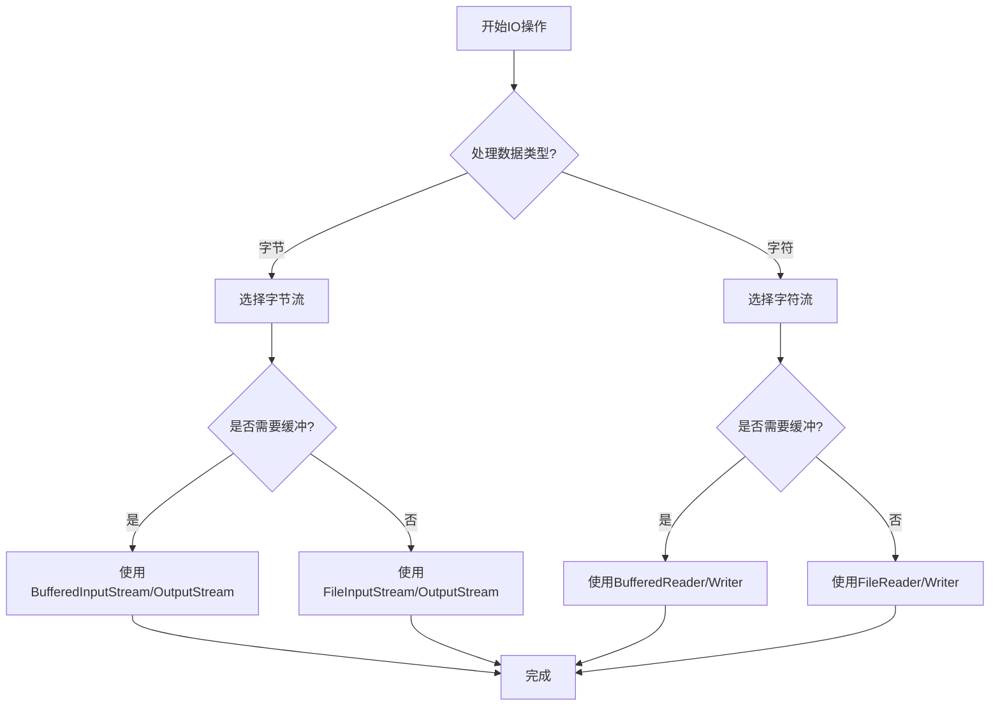

---

# 🌊 Java IO 流（Input/Output Stream）

## 一、IO 流原理与概念

### 1.1 流（Stream）的概念

- 流是数据在程序与数据源（文件、网络、内存等）之间传输的通道
- 类似于水流，数据像水一样通过管道流动
- Java 通过 `java.io` 包提供丰富的流类支持

### 1.2 流的分类

| 分类方式         | 类型         | 说明                         |
| ---------------- | ------------ | ---------------------------- |
| **数据流向**     | 输入流         | 从数据源读取到程序             |
|                  | 输出流         | 从程序写入到数据源             |
| **数据处理单位** | 字节流（Byte）  | 以字节为单位，适用于所有类型文件 |
|                  | 字符流（Char）  | 以字符为单位，适用于文本文件     |
| **功能角色**     | 节点流         | 直接连接数据源                 |
|                  | 处理流         | 对已有流进行包装，增强功能       |

---

## 二、四大抽象基类

| 类型       | 字节流          | 字符流        |
| ---------- | --------------- | ------------- |
| **输入流** | `InputStream`   | `Reader`      |
| **输出流** | `OutputStream`  | `Writer`      |

> 🔥 所有流都继承自这四个抽象类。

---

## 三、节点流（直接操作数据源）

### 3.1 文件流示例

#### 字节流读写：

```java
// 读取文件
FileInputStream fis = new FileInputStream("test.txt");
int b;
while ((b = fis.read()) != -1) {
    System.out.print((char) b);
}
fis.close();

// 写入文件
FileOutputStream fos = new FileOutputStream("output.txt");
fos.write("Hello".getBytes());
fos.close();
```

#### 字符流读写：

```java
// 读取文本文件（避免乱码）
FileReader fr = new FileReader("test.txt");
int c;
while ((c = fr.read()) != -1) {
    System.out.print((char) c);
}
fr.close();

// 写入文本文件
FileWriter fw = new FileWriter("output.txt");
fw.write("你好世界");
fw.close();
```

---

## 四、处理流（增强功能）

### 4.1 缓冲流（Buffered）

> 提升读写效率，减少磁盘 I/O 次数

```java
// 使用缓冲流读取文件
BufferedReader br = new BufferedReader(new FileReader("test.txt"));
String line;
while ((line = br.readLine()) != null) {
    System.out.println(line);
}
br.close();

// 使用缓冲流写入文件
BufferedWriter bw = new BufferedWriter(new FileWriter("output.txt"));
bw.write("Hello");
bw.newLine();
bw.write("World");
bw.close();
```

### 4.2 转换流（InputStreamReader / OutputStreamWriter）

> 字节流与字符流之间的桥梁，可指定编码

```java
// 将字节流转换为字符流，并指定编码
InputStreamReader isr = new InputStreamReader(
    new FileInputStream("test.txt"), "UTF-8");
BufferedReader br = new BufferedReader(isr);

// 将字符流转换为字节流
OutputStreamWriter osw = new OutputStreamWriter(
    new FileOutputStream("output.txt"), "ISO8859-1");
osw.write("Hello");
osw.close();
```

### 4.3 数据流（DataInputStream / DataOutputStream）

> 直接读写基本数据类型

```java
DataOutputStream dos = new DataOutputStream(
    new FileOutputStream("data.bin"));
dos.writeDouble(3.14);
dos.writeBoolean(true);
dos.close();

DataInputStream dis = new DataInputStream(
    new FileInputStream("data.bin"));
double num = dis.readDouble();
boolean flag = dis.readBoolean();
dis.close();
```

### 4.4 打印流（PrintStream / PrintWriter）

> 方便输出各种数据类型，自动 flush，不抛异常

```java
PrintStream ps = new PrintStream("log.txt");
System.setOut(ps); // 重定向标准输出到文件
System.out.println("Hello Log");
ps.close();
```

### 4.5 对象流（ObjectInputStream / ObjectOutputStream）

> 序列化与反序列化对象

```java
// 序列化
ObjectOutputStream oos = new ObjectOutputStream(
    new FileOutputStream("obj.bin"));
oos.writeObject(new Student("Alice"));
oos.close();

// 反序列化
ObjectInputStream ois = new ObjectInputStream(
    new FileInputStream("obj.bin"));
Student s = (Student) ois.readObject();
ois.close();
```

#### 🔑 序列化要求：

- 实现 `Serializable` 接口（标记接口）
- 使用 `transient` 关键字修饰不序列化的字段

```java
class Student implements Serializable {
    private String name;
    private transient int age; // 不会序列化
}
```

---

## 五、IO 流选择流程图



---

## 六、常见应用场景

| 场景               | 推荐流类组合                           |
| ------------------ | -------------------------------------- |
| 文本文件读取       | `FileReader` + `BufferedReader`        |
| 文本文件写入       | `FileWriter` + `BufferedWriter`        |
| 二进制文件读写     | `FileInputStream`/`FileOutputStream` + `Buffered` |
| 对象序列化         | `ObjectInputStream`/`ObjectOutputStream` |
| 网络数据传输       | `Socket` + `InputStream`/`OutputStream`   |
| 控制台输入         | `System.in` + `InputStreamReader` + `BufferedReader` |

---

## 七、总结对比

| 流类型         | 优点                 | 缺点                 | 适用场景           |
| -------------- | -------------------- | -------------------- | ------------------ |
| **字节流**     | 通用性强，可处理所有类型 | 处理文本需手动转码     | 图片、音频、视频等 |
| **字符流**     | 自动处理编码，适合文本   | 只能处理文本         | 文本文件           |
| **缓冲流**     | 减少IO次数，提升性能   | 需手动flush          | 大文件读写         |
| **对象流**     | 可直接读写对象         | 需实现Serializable   | 对象持久化         |

---

如果想要进一步调整，请随时告诉我。以下是根据你提供的《JavaSE：IO流》PDF内容整理的 Obsidian 笔记，采用清晰的结构、美观的排版，并融入了流程图、代码块、表格对比等元素，便于复习与记忆。

---

# 🌊 Java IO 流（Input/Output Stream）

## 一、IO 流原理与概念

### 1.1 流（Stream）的概念

- 流是数据在程序与数据源（文件、网络、内存等）之间传输的通道
- 类似于水流，数据像水一样通过管道流动
- Java 通过 `java.io` 包提供丰富的流类支持

### 1.2 流的分类

| 分类方式         | 类型         | 说明                         |
| ---------------- | ------------ | ---------------------------- |
| **数据流向**     | 输入流         | 从数据源读取到程序             |
|                  | 输出流         | 从程序写入到数据源             |
| **数据处理单位** | 字节流（Byte）  | 以字节为单位，适用于所有类型文件 |
|                  | 字符流（Char）  | 以字符为单位，适用于文本文件     |
| **功能角色**     | 节点流         | 直接连接数据源                 |
|                  | 处理流         | 对已有流进行包装，增强功能       |

---

## 二、四大抽象基类

| 类型       | 字节流          | 字符流        |
| ---------- | --------------- | ------------- |
| **输入流** | `InputStream`   | `Reader`      |
| **输出流** | `OutputStream`  | `Writer`      |

> 🔥 所有流都继承自这四个抽象类。

---

## 三、节点流（直接操作数据源）

### 3.1 文件流示例

#### 字节流读写：

```java
// 读取文件
FileInputStream fis = new FileInputStream("test.txt");
int b;
while ((b = fis.read()) != -1) {
    System.out.print((char) b);
}
fis.close();

// 写入文件
FileOutputStream fos = new FileOutputStream("output.txt");
fos.write("Hello".getBytes());
fos.close();
```

#### 字符流读写：

```java
// 读取文本文件（避免乱码）
FileReader fr = new FileReader("test.txt");
int c;
while ((c = fr.read()) != -1) {
    System.out.print((char) c);
}
fr.close();

// 写入文本文件
FileWriter fw = new FileWriter("output.txt");
fw.write("你好世界");
fw.close();
```

---

## 四、处理流（增强功能）

### 4.1 缓冲流（Buffered）

> 提升读写效率，减少磁盘 I/O 次数

```java
// 使用缓冲流读取文件
BufferedReader br = new BufferedReader(new FileReader("test.txt"));
String line;
while ((line = br.readLine()) != null) {
    System.out.println(line);
}
br.close();

// 使用缓冲流写入文件
BufferedWriter bw = new BufferedWriter(new FileWriter("output.txt"));
bw.write("Hello");
bw.newLine();
bw.write("World");
bw.close();
```

### 4.2 转换流（InputStreamReader / OutputStreamWriter）

> 字节流与字符流之间的桥梁，可指定编码

```java
// 将字节流转换为字符流，并指定编码
InputStreamReader isr = new InputStreamReader(
    new FileInputStream("test.txt"), "UTF-8");
BufferedReader br = new BufferedReader(isr);

// 将字符流转换为字节流
OutputStreamWriter osw = new OutputStreamWriter(
    new FileOutputStream("output.txt"), "ISO8859-1");
osw.write("Hello");
osw.close();
```

### 4.3 数据流（DataInputStream / DataOutputStream）

> 直接读写基本数据类型

```java
DataOutputStream dos = new DataOutputStream(
    new FileOutputStream("data.bin"));
dos.writeDouble(3.14);
dos.writeBoolean(true);
dos.close();

DataInputStream dis = new DataInputStream(
    new FileInputStream("data.bin"));
double num = dis.readDouble();
boolean flag = dis.readBoolean();
dis.close();
```

### 4.4 打印流（PrintStream / PrintWriter）

> 方便输出各种数据类型，自动 flush，不抛异常

```java
PrintStream ps = new PrintStream("log.txt");
System.setOut(ps); // 重定向标准输出到文件
System.out.println("Hello Log");
ps.close();
```

### 4.5 对象流（ObjectInputStream / ObjectOutputStream）

> 序列化与反序列化对象

```java
// 序列化
ObjectOutputStream oos = new ObjectOutputStream(
    new FileOutputStream("obj.bin"));
oos.writeObject(new Student("Alice"));
oos.close();

// 反序列化
ObjectInputStream ois = new ObjectInputStream(
    new FileInputStream("obj.bin"));
Student s = (Student) ois.readObject();
ois.close();
```

#### 🔑 序列化要求：

- 实现 `Serializable` 接口（标记接口）
- 使用 `transient` 关键字修饰不序列化的字段

```java
class Student implements Serializable {
    private String name;
    private transient int age; // 不会序列化
}
```

---

## 五、IO 流选择流程图


---

## 六、常见应用场景

| 场景               | 推荐流类组合                           |
| ------------------ | -------------------------------------- |
| 文本文件读取       | `FileReader` + `BufferedReader`        |
| 文本文件写入       | `FileWriter` + `BufferedWriter`        |
| 二进制文件读写     | `FileInputStream`/`FileOutputStream` + `Buffered` |
| 对象序列化         | `ObjectInputStream`/`ObjectOutputStream` |
| 网络数据传输       | `Socket` + `InputStream`/`OutputStream`   |
| 控制台输入         | `System.in` + `InputStreamReader` + `BufferedReader` |

---

## 七、总结对比

| 流类型         | 优点                 | 缺点                 | 适用场景           |
| -------------- | -------------------- | -------------------- | ------------------ |
| **字节流**     | 通用性强，可处理所有类型 | 处理文本需手动转码     | 图片、音频、视频等 |
| **字符流**     | 自动处理编码，适合文本   | 只能处理文本         | 文本文件           |
| **缓冲流**     | 减少IO次数，提升性能   | 需手动flush          | 大文件读写         |
| **对象流**     | 可直接读写对象         | 需实现Serializable   | 对象持久化         |
