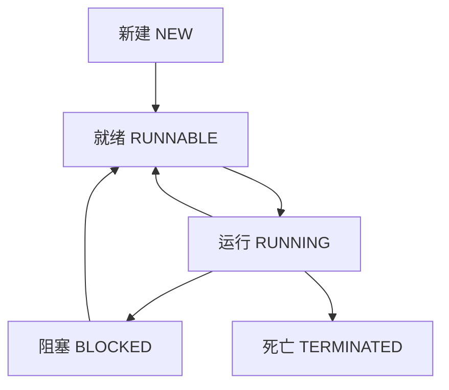

# 🧵 Java 多线程编程

## 一、线程简介

### 1.1 什么是线程？

> 线程是程序中的执行路径，是 CPU 调度和执行的最小单位。

- **程序**：静态的代码集合
- **进程**：执行程序的一次过程，是系统资源分配的单位
- **线程**：进程中的执行单元，是 CPU 调度的单位

### 1.2 多线程的应用场景

- 同时下载多个文件
- 后台运行定时任务
- 游戏中的音画同步
- 用户界面响应与后台计算

---

## 二、线程的创建方式

### 2.1 继承 Thread 类

```java
public class MyThread extends Thread {
    @Override
    public void run() {
        for (int i = 0; i < 10; i++) {
            System.out.println("我在写代码--" + i);
        }
    }

    public static void main(String[] args) {
        MyThread t1 = new MyThread();
        t1.start(); // 启动线程
    }
}
```

### 2.2 实现 Runnable 接口（推荐）

```java
public class MyRunnable implements Runnable {
    @Override
    public void run() {
        for (int i = 0; i < 10; i++) {
            System.out.println("我在摸鱼--" + i);
        }
    }

    public static void main(String[] args) {
        Thread t = new Thread(new MyRunnable());
        t.start();
    }
}
```

### 2.3 实现 Callable 接口（了解）

```java
public class MyCallable implements Callable<String> {
    @Override
    public String call() throws Exception {
        return "Callable 返回值";
    }

    public static void main(String[] args) throws Exception {
        ExecutorService ser = Executors.newFixedThreadPool(1);
        Future<String> result = ser.submit(new MyCallable());
        System.out.println(result.get());
        ser.shutdown();
    }
}
```

### 2.4 Lambda 表达式简化写法

```java
new Thread(() -> {
    for (int i = 0; i < 10; i++) {
        System.out.println("Lambda 线程--" + i);
    }
}).start();
```

---

## 三、线程状态与生命周期



### 3.1 常用线程方法

| 方法                     | 说明                         |
| ------------------------ | ---------------------------- |
| `sleep(long millis)`     | 线程休眠，不释放锁             |
| `join()`                 | 等待该线程执行完毕             |
| `yield()`                | 礼让，让出 CPU 时间片          |
| `setPriority(int)`       | 设置线程优先级（1-10）         |
| `interrupt()`            | 中断线程（不建议直接使用）       |

---

## 四、线程同步与锁机制

### 4.1 同步代码块

```java
synchronized (obj) {
    // 需要同步的代码
}
```

### 4.2 同步方法

```java
public synchronized void method() {
    // 同步方法体
}
```

### 4.3 Lock 锁（推荐）

```java
private final ReentrantLock lock = new ReentrantLock();

public void method() {
    lock.lock();
    try {
        // 线程安全代码
    } finally {
        lock.unlock(); // 必须手动释放锁
    }
}
```

### 4.4 synchronized vs Lock

| 特性         | synchronized | Lock          |
| ------------ | ------------ | ------------- |
| 锁获取方式     | 自动         | 手动          |
| 锁释放方式     | 自动         | 手动          |
| 灵活性        | 低           | 高            |
| 性能          | 较低         | 较高          |

---

## 五、线程通信：生产者消费者模型

### 5.1 使用 wait() 和 notify()

```java
class Buffer {
    private int value;
    private boolean isEmpty = true;

    public synchronized void put(int value) {
        while (!isEmpty) {
            wait(); // 等待消费者取走
        }
        this.value = value;
        isEmpty = false;
        notify(); // 通知消费者
    }

    public synchronized int take() {
        while (isEmpty) {
            wait(); // 等待生产者生产
        }
        isEmpty = true;
        notify(); // 通知生产者
        return value;
    }
}
```

### 5.2 使用 BlockingQueue（推荐）

```java
BlockingQueue<Integer> queue = new ArrayBlockingQueue<>(10);

// 生产者
queue.put(1);

// 消费者
int value = queue.take();
```

---

## 六、线程池（ThreadPool）

### 6.1 创建线程池

```java
ExecutorService pool = Executors.newFixedThreadPool(5);

pool.execute(() -> {
    System.out.println("线程任务执行");
});

pool.shutdown();
```

### 6.2 线程池参数说明

| 参数                | 说明                 |
| ------------------- | -------------------- |
| corePoolSize        | 核心线程数             |
| maximumPoolSize     | 最大线程数             |
| keepAliveTime       | 空闲线程存活时间         |
| workQueue           | 任务队列               |
| threadFactory       | 线程工厂               |
| handler             | 拒绝策略               |

---

## 七、死锁与避免

### 7.1 死锁产生的四个必要条件

1. 互斥条件
2. 请求与保持条件
3. 不剥夺条件
4. 循环等待条件

### 7.2 避免死锁的方法

- 避免嵌套锁
- 使用定时锁 `tryLock()`
- 按顺序获取锁

---

## 八、总结与最佳实践

- ✅ 优先使用 `Runnable` 和 `Lambda`
- ✅ 使用 `Lock` 替代 `synchronized`
- ✅ 使用线程池管理线程
- ✅ 使用 `BlockingQueue` 实现线程通信
- ❌ 避免使用 `stop()`、`suspend()` 等过时方法
- ❌ 避免死锁和资源竞争

---

> 🎯 多线程是 Java 编程中的重要组成部分，掌握好线程的使用和同步机制，能显著提升程序性能和响应能力。