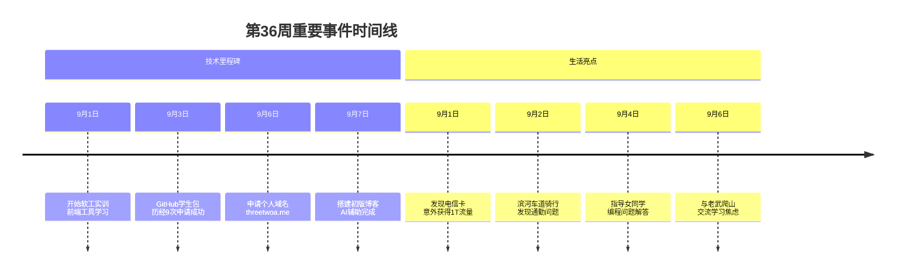
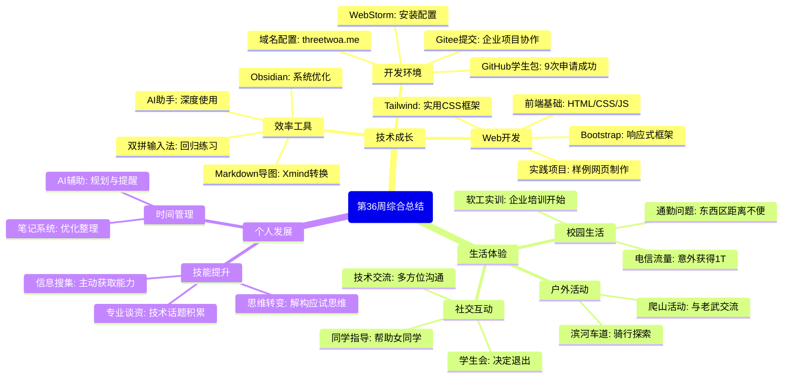
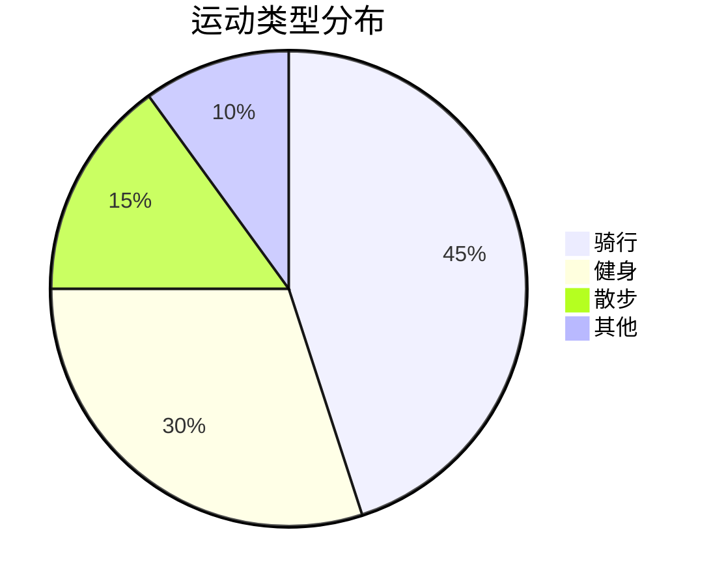

---

---
# 本周总览
---
## 时间线

> 🌈 **摘抄语录**：生活是技术之外的另一种修行，在代码与世界之间找到平衡，让每一天都充满意义和成长
---

# 生活日程

| time       | thing                                                                                                                                                            | feeling                                        | note(备注) |
| ---------- | ---------------------------------------------------------------------------------------------------------------------------------------------------------------- | ---------------------------------------------- | -------- |
| 2025-08-31 | 刚班主任查寝，我们几个跑去吃饭了[憨笑]                                                                                                                                             | 经典操作哈哈                                         |          |
| 2025-09-01 | 1.企业培训三周,前端的工具,语法内容,然后做样例网页, 2.维护了下自行车                                                                                                                        | 吴老师讲的不错,实用都是干货,github,gitee提交代码,企业,实习,规划,考研都有说 | ⭐⭐⭐⭐⭐    |
| 2025-09-02 | 1.样例网页的培训内容,这周主要是前端三件套2.弄好自行车,去了滨河车道转了一下                                                                                                                         | 发现每次去上课都要从西区赶往东区(还带个拐弯),对我们文瀛真不友好              | ⭐⭐⭐      |
| 2025-09-03 | 1.github学生包申请成功了, 2.同时企业老师分配了大作业,我和刘换了一下项目                                                                                                                    |                                                | ⭐⭐⭐⭐⭐    |
| 2025-09-04 | 1.又开始回归练习双拼了,虽然全拼很顺手吧, 2.给旁边的女生指导了一下                                                                                                                          | 觉得未来还是需要熟练使用音码或者形码来提高效率                        |          |
| 2025-09-05 | 1.学会更加深度利用了ds,(指定规划,笔记整理,专业问题询问,教程指导....) 2.然后重新利用OB,ds,学生包等资源发展,重新翻新了一下OB实用化一点, 3.打算离开学生会这个地方寻清净                                                          |                                                |          |
| 2025-09-06 | 1.和老武(绩点很好)爬了山,他倒是聊了挺多的,牢骚的,焦虑的氛围,跟我简直是两个极端 2.看了狂神javase导图和一些网络编程 3.申请了threetwoa.me域名(一年)  + github Pages部署 4.了解并且配置了Tailwind  CSS 5.接触博客,打算狗之间自己的网站 | 我还是按照自己"混子路线"发展,专注走技术路线,该干嘛干嘛,不内耗              |          |
| 2025-09-07 | 1.ai辅导下搭建了自己的初版blog页面 2.下午拿ai当做牛马给我对照pdf产出OB的javase笔记,将OB融入到自己的笔记管理系统里面                                                                                       | OB这块废了不少心力,不过之后应该会起到大作用                        |          |

# 🎯学习

## 技术了解
- 安装webstorm , Gitee提交代码 ,git仓库配置(未完成)  #nocomplement
- 视频总结上传到网盘用即可,html + css + js + Bootstrap结合使用的样例,
- 搜狗输入法能够在中文状态下输入英文符号,真方便
- 重拾双拼,然后了解音码,形码,
- 前端三件套 + Bootstrap + Tailwind CSS
- 导入markdown进入Xmind快速制作思维导图的模版
- codepen素材区域
- ....
(第一周比较简略,后续慢慢优化笔记习惯)

---

## 信息摄入
### 干货 #review
- 早上吴讲了培养主动搜集信息素养的能力，建立专业技术谈资的能力，解构应试思维的能力，重复使用是记忆之道
- 工作后 技术 转向 对业务的熟悉程度，接触业务的时候需要了解功能业务图
- xmind复习➕csdn博客记录

## 成就墙

1. ✅ GitHub学生包成功申请
2. ✅  github包中的namecheap配置了域名threetwoa.me,用github Pages用ds配置了blog初版界面
3. ✅ 学会更加深度利用了ds,(指定规划,笔记整理,专业问题询问,教程指导....)
4. ✅ 双拼比之前熟悉多了,虽然目前还是全拼为主

---

# 🌍 生活

## 新鲜事单独陈列

| time       | thing                                | feeling                                              | notes |
| ---------- | ------------------------------------ | ---------------------------------------------------- | ----- |
| 2025-09-01 | 开始软工实训，发现电信的流量竟然有1个t,问了办卡的人说可能我是漏网之鱼 | 办卡的和舍友都震惊了哈哈                                         |       |
| 2025-09-02 | 滨河车道还是那个车道,但我不胜之前了哈哈,之后还要锻炼呢         | 哎,还需要慢慢变成之前的样子呢,尤其是自行车大伤后适合通勤骑                       |       |
| 2025-09-03 | github学生包历经9次失败申请成功通过了               | 这是不容易啊哈哈,前5次都是vpn,后面让咸鱼老哥帮我,他也蒙了,我的vpn关不掉,ip跑到德州了啊哈哈 |       |
| 2025-09-04 | 下午好像没有作业.,太无聊给坐在旁边的女同学指导了一下哈哈,       | 很少跟女生聊天,不过网上说要把女生当做兄弟一样聊就会少一些拘束感                     | ⭐⭐⭐⭐⭐ |

## 🏃 户外活动
(第一周没有用)
### 🚴 运动记录

## 📊 反思回顾
不过还没开始进行算法每日一练 #emergency

