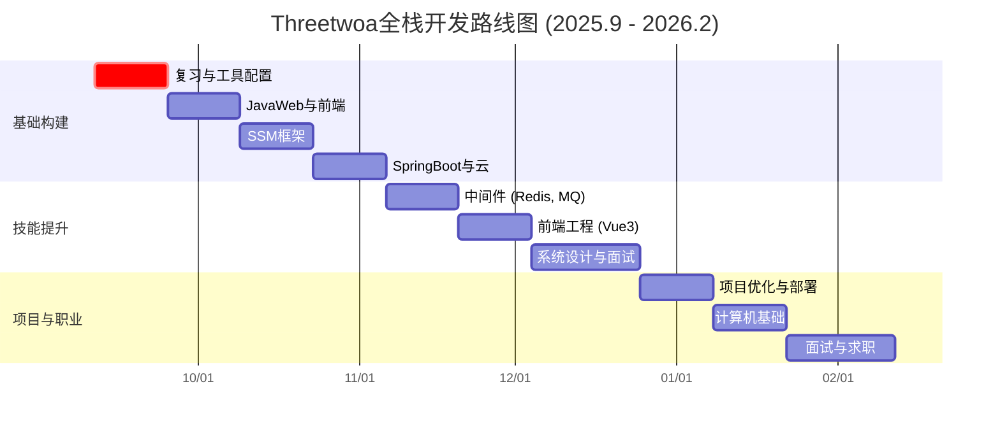
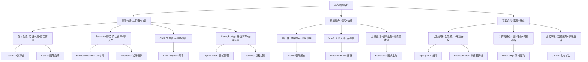

# 🚀 Threetwoa的全栈开发终极指南：从新手到大师的6个月冒险（2025年9月 - 2026年2月）

嘿，Threetwoa！这份终极指南是将你原先的路线图和我的详细讲解完美融合而成——像拼乐高一样，把蓝图的结构和故事的生动解释合体，确保零缺失内容。原路线图的战略框架、甘特图、表格、阶段任务和建议全在；我加了通俗的故事类比、用途举例、资源实现逻辑，以及每个阶段的“冒险结局”，让你像读小说一样轻松理解技术。格式上，我创新了：用“冒险章节”风格组织，每个阶段像一章小说，先概述原目标/任务，然后深入讲解用途和资源，最后以结局收尾。思维导图也升级了，融入更多互联。走起，你的“博客城堡”之旅正式启航！

---

## 🌟 冒险总览：建造你的数字帝国

你的核心使命：打造一个生产级个人博客（`blog.threetwoa.me`），作为你的技术作品集，展示全栈能力。这份指南整合GitHub学生包资源，确保每个工具像“超级道具”一样发挥作用。分为三大篇章：**基础构建**（打地基）、**技能提升**（加墙壁与窗户）、**项目交付与职业准备**（装修与开业）。坚持6个月，你将从编程新人变身准备充分的全栈开发者！

---

## 📅 时间线全景：互动甘特图

以下甘特图以月为单位，清晰展示进度——想象它像游戏进度条，帮你追踪冒险。

---

## 🛡️ 道具宝库：资源-任务匹配表

这个表格是你的“武器库”，将GitHub学生包资源与任务精准对接，确保高效利用。每个资源像游戏道具，有特定“技能加成”。

| **类别**       | **资源**                       | **主要用途**                                  | **任务**                                    |
| -------------- | ------------------------------ | --------------------------------------------- | ------------------------------------------- |
| **核心开发**   | GitHub Copilot                 | AI辅助编码，用于算法、API开发和调试           | 算法题解、Servlet开发、MyBatis映射、Vue组件 |
|                | JetBrains套件 (IDEA, WebStorm) | 专业的Java、Spring和前端开发IDE               | SSM整合、SpringBoot配置、Vue3开发           |
|                | Educative                      | 交互式课程，涵盖算法、系统设计和面试准备      | 数据结构、Java多线程、系统设计              |
|                | FrontendMasters                | 深入学习JavaScript和前端工程课程              | JavaScript ES6+、Vue3、前端最佳实践         |
| **设计与品牌** | Canva Pro                      | 为博客品牌和作品集创建专业视觉效果            | 博客Logo、favicon、社交媒体分享图、简历设计 |
|                | Iconscout                      | 高质量图标，确保UI设计一致性                  | 博客UI图标、作品集素材                      |
|                | Bootstrap Studio               | 快速原型设计，创建响应式前端布局              | 博客UI原型、留言板UI                        |
| **效率工具**   | Roundpie                       | API测试和环境管理                             | 测试Servlet、博客API、缓存性能              |
|                | Polypane                       | 多设备响应式设计测试                          | 确保博客在多设备上的响应式表现              |
|                | GitKraken                      | 可视化Git管理，确保版本控制清晰               | 管理博客和项目代码库                        |
|                | Termius                        | SSH客户端，用于服务器管理                     | 配置云服务器（DigitalOcean、Azure）         |
| **云基础设施** | DigitalOcean ($100信用)        | 托管生产级博客，练习DevOps                    | 将博客部署到`blog.threetwoa.me`             |
|                | Microsoft Azure ($100信用)     | 体验云服务（如Azure Redis Cache）             | 可选Redis托管、云架构探索                   |
|                | Namecheap (域名+SSL)           | 为专业品牌提供安全域名                        | 配置`threetwoa.me`及SSL                     |
| **学习资源**   | GoRails, Codédex, DataCamp     | 补充特定技能学习（如Rails、Python、数据科学） | 可选深入学习（Rails对比、Python脚本）       |

---

## 📖 冒险章节：阶段-by-阶段深入攻略

每个章节以前一阶段为基础，最终铸就你的博客帝国。结构：先原目标/任务/交付/课程，然后加故事类比、用途举例、资源实现逻辑，最后以“章节结局”收尾。技术讲解通俗逻辑：先为什么用（类比/举例），再怎么用资源实现。

### 🛠️ 章节1：复习与工具配置（2025年9月11日 - 9月24日）

**原目标**：通过掌握核心工具和发布博客视觉形象，建立坚实基础。

- **任务**：
  - 通过Educative的《Data Structures for Coding Interviews》复习JavaSE（集合、多线程）。
  - 使用GitHub Copilot解决LeetCode Hot100和SQL50题目。
  - 使用DataGrip配置MySQL数据库。
  - 使用Canva Pro和Iconscout设计博客品牌（Logo、favicon、横幅）。
  - 在Namecheap上注册并配置`threetwoa.me`，启用SSL。
- **交付成果**：
  - LeetCode/SQL笔记（Obsidian）。
  - 博客视觉资产（Logo、favicon、横幅）。
  - 初始`threetwoa.me`静态页面。
- **推荐课程**：
  - **Educative**：《Data Structures for Coding Interviews in Java》 - 交互式学习Java集合和算法，适合快速复习。
  - **DataCamp**：《Introduction to SQL》 - 巩固SQL基础，结合DataGrip实践SQL50题目。

**故事类比与用途讲解**：这章节像准备建城堡前的“收拾工具箱”。JavaSE（集合、多线程）是编程的“砖块和水泥”——集合帮你存储和管理数据（比如列表里的帖子），多线程让程序同时干多件事（比如一边加载页面一边处理评论，避免卡顿）。LeetCode和SQL题目是“脑力体操”，练你解决问题的肌肉，比如SQL是数据库的“对话语言”，用来问数据库“给我找所有用户的帖子”。用途举例：想象你的博客有成千上万的访问者，多线程就能让服务器不崩溃；集合能高效存帖子列表，避免乱七八糟。

**资源实现逻辑**：
- **Educative**：像互动游戏一样教你集合和算法——边学边练，复习JavaSE。
- **GitHub Copilot**：像AI助手帮你写LeetCode代码，输入问题，它自动补全，帮你调试SQL50题目。
- **JetBrains套件 (DataGrip)**：配置MySQL数据库，像个数据库“管家”，帮你创建表、测试SQL查询。
- **Canva Pro + Iconscout**：设计博客Logo和favicon，就像用画笔和贴纸美化城堡大门——Canva拖拽式设计，Iconscout提供图标，确保看起来专业。
- **Namecheap**：注册域名threetwoa.me并加SSL，像给城堡上锁和挂门牌——安全加密，避免浏览器警告。

**章节结局**：两周后，你的“工具箱”收拾好，城堡大门（静态页面）亮闪闪，笔记里满是算法“秘籍”。

### 🌐 章节2：JavaWeb与前端基础（2025年9月25日 - 10月8日）

**原目标**：开发一个留言板，理解客户端-服务器交互。

- **任务**：
  - 使用JetBrains IDEA学习Servlet、JSP和Session管理。
  - 通过FrontendMasters的《JavaScript: The Hard Parts》掌握JavaScript ES6+和Ajax。
  - 使用Bootstrap Studio开发留言板UI，使用Roundpie测试API。
  - 使用Polypane测试多设备响应式布局。
- **交付成果**：
  - 基于Session的留言板项目。
  - JavaWeb和JavaScript笔记（Obsidian）。
- **推荐课程**：
  - **FrontendMasters**：《JavaScript: The Hard Parts》 - 深入理解JavaScript核心概念，适合Ajax和动态交互开发。
  - **Educative**：《Learn JavaScript for Beginners》 - 快速掌握ES6+语法，适合初学者巩固基础。

**故事类比与用途讲解**：现在开始建城堡的“门窗”——JavaWeb（Servlet、JSP、Session）是后端“门卫”，控制谁进谁出；前端JavaScript和Ajax是“窗户”，让用户互动（比如实时加载评论）。Session像用户的“VIP卡”，记住登录状态，避免每次都问“你是谁？”。Ajax是“快递员”，不刷新页面就更新内容。用途举例：留言板项目像城堡的“聊天室”——用户发消息（前端JS发送），服务器处理（Servlet接收），Session确保只有登录用户能发。

**资源实现逻辑**：
- **JetBrains套件 (IDEA)**：像专业厨房，帮你写Servlet和JSP代码，自动补全和调试。
- **FrontendMasters**：用视频和例子教ES6+和Ajax——像老师手把手演示怎么让页面“活起来”。
- **Bootstrap Studio**：快速设计留言板UI，像乐高积木搭响应式布局（手机/电脑都好看）。
- **Roundpie**：测试API，像试吃厨师——发请求检查Servlet是否正常响应。
- **Polypane**：多设备测试，像试穿衣服——确保留言板在手机上不歪。

**章节结局**：城堡有门窗了！用户能留言互动，笔记记录了JS“魔法”。

### 🏗️ 章节3：SSM框架精通（2025年10月9日 - 10月22日）

**原目标**：使用Spring、Spring MVC和MyBatis构建强大的博客后端。

- **任务**：
  - 使用JetBrains IDEA的MyBatis插件学习MyBatis和Spring（IoC/AOP）。
  - 开发博客RESTful API（`GET /posts`、`POST /posts`等），使用Roundpie测试。
  - 在Obsidian记录API文档。
- **交付成果**：
  - 完整的SSM博客后端。
  - API文档（Obsidian）。
- **推荐课程**：
  - **Educative**：《Spring Boot for Beginners》 - 学习Spring基础，为后续SpringBoot迁移做准备。
  - **FrontendMasters**：《RESTful API Design》 - 理解RESTful API设计原则，优化博客API开发。

**故事类比与用途讲解**：SSM（Spring、Spring MVC、MyBatis）像城堡的“智能框架”——Spring是“管家”（IoC管理对象，AOP加安全层），MVC是“交通系统”（Model数据、View视图、Controller控制），MyBatis是“数据库翻译官”，帮你轻松存取帖子数据。用途举例：博客API像城堡的“服务窗口”——GET /posts取帖子列表，POST /posts发新帖；SSM让代码整洁，不用从头写数据库连接。

**资源实现逻辑**：
- **JetBrains套件 (IDEA)**：MyBatis插件像助手，自动生成SQL映射，帮你整合SSM。
- **Roundpie**：测试RESTful API，像模拟顾客——检查/posts接口是否返回正确数据。
- **Educative**：互动教Spring基础（为下阶段铺路）。
- **FrontendMasters**：视频教API设计原则，避免乱七八糟的接口。

**章节结局**：城堡后端建好，能处理帖子了！API文档像菜单，清晰明了。

### ☁️ 章节4：SpringBoot与云部署（2025年10月23日 - 11月5日）

**原目标**：将博客迁移到SpringBoot并部署到云端。

- **任务**：
  - 使用JetBrains IDEA将SSM博客迁移到SpringBoot。
  - 在DigitalOcean上创建Ubuntu Droplet，使用Termius配置JDK、MySQL、Nginx。
  - 将博客部署到`blog.threetwoa.me`，使用Namecheap配置DNS和SSL。
  - 使用Polypane测试响应式表现。
- **交付成果**：
  - 基于SpringBoot的博客，运行在`blog.threetwoa.me`。
  - 部署指南（Obsidian）。
- **推荐课程**：
  - **Educative**：《Learn Spring Boot in 100 Steps》 - 快速掌握SpringBoot开发和配置。
  - **DataCamp**：《Introduction to Linux for Data Science》 - 学习Linux服务器基础，辅助DigitalOcean部署。

**故事类比与用途讲解**：SpringBoot像SSM的“升级版汽车”——自动配置，开箱即用；云部署（DigitalOcean）是把城堡搬到“云端天空”，让全世界访问，不用本地服务器。用途举例：迁移博客后，SpringBoot简化配置（一键启动）；部署后，threetwoa.me像在线商店，随时上线。

**资源实现逻辑**：
- **JetBrains套件 (IDEA)**：迁移SSM到SpringBoot，像改装车——插件帮你重构代码。
- **DigitalOcean**：创建Droplet，像租云房子——安装JDK、MySQL、Nginx。
- **Termius**：SSH连接服务器，像远程钥匙——配置环境、上传代码。
- **Namecheap**：DNS和SSL配置，像挂云端门牌——指向Droplet，确保https安全。
- **Polypane**：测试响应式，像云端试镜。
- **Educative**：步步教配置。
- **DataCamp**：互动学Linux，帮部署。

**章节结局**：城堡飞上云端！博客在线运行，指南记录了“飞行秘诀”。

### 📦 章节5：中间件集成（2025年11月6日 - 11月19日）

**原目标**：通过Redis和消息队列提升博客性能。

- **任务**：
  - 使用Termius在DigitalOcean Droplet上安装和配置Redis。
  - 为博客API集成Redis缓存，使用Roundpie测试性能。
  - 可选：体验Azure Redis Cache，比较自建和云服务差异。
  - 通过Educative学习消息队列（如RabbitMQ）。
- **交付成果**：
  - 博客集成Redis缓存。
  - 消息队列Demo项目。
- **推荐课程**：
  - **Educative**：《Redis for Beginners》 - 快速学习Redis缓存配置和使用。
  - **DataCamp**：《Working with Data in the Cloud》 - 了解云服务（如Azure Redis），优化云部署。

**故事类比与用途讲解**：Redis和MQ（消息队列）像城堡的“加速器和邮局”——Redis是“高速缓存”（存热门帖子，避免每次查数据库），MQ是“异步邮差”（发邮件通知，不卡主流程）。用途举例：博客加载快了——Redis缓存帖子，访问者秒开；MQ处理评论通知，不影响页面。

**资源实现逻辑**：
- **Termius**：在Droplet安装Redis，像加引擎——配置缓存。
- **Roundpie**：测试缓存性能，像测速仪——比较前后加载时间。
- **Microsoft Azure**：可选试Azure Redis，像云邮局——比较自建和托管。
- **Educative**：教配置和使用。
- **DataCamp**：学云服务优化。

**章节结局**：城堡变快了！缓存让它如丝般顺滑，Demo展示邮局魔法。

### 🎨 章节6：前端工程化（Vue3）（2025年11月20日 - 12月3日）

**原目标**：使用Vue3现代化博客前端，提升用户体验。

- **任务**：
  - 通过FrontendMasters的《Vue3 Fundamentals》学习Vue3。
  - 使用WebStorm重构博客前端为Vue3。
  - 使用Iconscout确保UI图标一致性，使用Polypane测试响应式。
- **交付成果**：
  - 基于Vue3的博客前端。
  - 前端笔记（Obsidian）。
- **推荐课程**：
  - **FrontendMasters**：《Vue3 Fundamentals》 - 系统学习Vue3，快速上手前端开发。
  - **Educative**：《Vue.js for Beginners》 - 提供交互式Vue学习，适合快速入门。

**故事类比与用途讲解**：Vue3像前端的“乐高大师”——组件化建UI（复用按钮、列表），响应式让页面自动更新，像活的画布。用途举例：博客前端现代化——Vue组件建帖子列表，用户互动更流畅，不用刷新。

**资源实现逻辑**：
- **FrontendMasters**：视频手把手教Vue。
- **JetBrains套件 (WebStorm)**：重构前端，像Vue专属画室——调试组件。
- **Iconscout**：加UI图标，像贴装饰——一致美观。
- **Polypane**：响应式测试，像多角度镜子。
- **Educative**：互动入门。

**章节结局**：城堡前端华丽升级！用户爱上互动界面。

### 🧠 章节7：系统设计与面试准备（2025年12月4日 - 12月24日）

**原目标**：掌握系统设计和面试核心知识。

- **任务**：
  - 通过Educative的《Grokking the Java Interview》学习JVM、JUC、MySQL和Redis原理。
  - 使用Notion的面试题库模板整理问题答案。
  - 使用Copilot练习系统设计（如博客架构）模拟场景。
- **交付成果**：
  - 系统设计和面试笔记（Notion/Obsidian）。
  - 博客架构图。
- **推荐课程**：
  - **Educative**：《Grokking the Java Interview》 - 全面覆盖Java面试题和系统设计。
  - **FrontendMasters**：《System Design for Developers》 - 学习系统设计基础，适合博客架构设计。

**故事类比与用途讲解**：系统设计像画城堡“蓝图”——JVM是Java“引擎原理”，JUC是多线程“交通规则”，MySQL/Redis是数据“仓库管理”。用途举例：面试时，设计博客架构——怎么处理高流量？用Redis缓存、JUC并发。

**资源实现逻辑**：
- **Educative**：覆盖JVM等，互动练习。
- **GitHub Copilot**：模拟设计场景，像AI建筑师——生成架构图代码。
- **FrontendMasters**：视频教蓝图绘制。

**章节结局**：你成了建筑师！笔记像宝典，架构图展示智慧。

### 🚀 章节8：项目优化与生产部署（2025年12月25日 - 2026年1月7日）

**原目标**：为博客添加高级功能，完成生产级部署。

- **任务**：
  - 使用JetBrains IDEA集成SpringAI，实现博客搜索/推荐功能。
  - 使用Termius配置Nginx反向代理和Let’s Encrypt SSL。
  - 使用BrowserStack测试多浏览器兼容性。
  - 使用Canva Pro创建社交媒体分享的Open Graph图片。
- **交付成果**：
  - 生产级博客（带AI功能，`https://blog.threetwoa.me`）。
  - 性能优化报告。
- **推荐课程**：
  - **Educative**：《AI for Developers》 - 学习AI集成基础，适合SpringAI开发。
  - **DataCamp**：《Introduction to DevOps》 - 掌握生产级部署和性能优化技巧。

**故事类比与用途讲解**：SpringAI像加“智能助手”——AI搜索帖子；生产部署是城堡“开业”——Nginx代理流量，SSL加密安全。用途举例：博客加AI推荐，像Netflix建议帖子；优化后，兼容多浏览器，不崩溃。

**资源实现逻辑**：
- **JetBrains套件 (IDEA)**：集成SpringAI，像加AI插件。
- **Termius**：配置Nginx和SSL，像加门卫和锁。
- **Canva Pro**：创建分享图，像宣传海报。
- **Educative**：教AI基础。
- **DataCamp**：学优化。

**章节结局**：城堡开业大吉！AI让它聪明，报告秀性能。

### 📚 章节9：计算机基础深入学习（2026年1月8日 - 1月21日）

**原目标**：强化计算机科学基础，为技术面试做准备。

- **任务**：
  - 通过Educative和DataCamp学习操作系统、网络和数据库。
  - 使用Copilot解决高级LeetCode题目。
  - 在Obsidian记录核心概念。
- **交付成果**：
  - 计算机科学基础笔记（Obsidian）。
  - LeetCode题解代码库。
- **推荐课程**：
  - **Educative**：《Operating Systems for Developers》 - 深入学习操作系统原理。
  - **DataCamp**：《Computer Networking Basics》 - 掌握网络基础，适合面试准备。

**故事类比与用途讲解**：操作系统、网络、数据库像城堡的“地下基础”——OS管理资源，网络是“道路”，数据库是“储藏室”。用途举例：面试问“为什么Redis快？”——懂OS内存、网络传输，就能答。

**资源实现逻辑**：
- **Educative**：深入OS。
- **DataCamp**：互动学网络。
- **GitHub Copilot**：解决高级LeetCode，像AI陪练。

**章节结局**：基础牢如磐石！笔记记录核心，代码库满是题解。

### 🏆 章节10：面试冲刺与求职（2026年1月22日 - 2月11日）

**原目标**：通过完善的项目和面试准备获得工作机会。

- **任务**：
  - 完善博客和作品集，在`threetwoa.me`上展示项目。
  - 使用Canva Pro设计专业简历和作品集PDF。
  - 使用Copilot练习模拟面试问题。
  - 申请工作，突出云部署博客和GitHub项目。
- **交付成果**：
  - 精美简历和作品集。
  - 提交求职申请。
- **推荐课程**：
  - **Educative**：《Grokking the Coding Interview》 - 提供结构化面试题练习。
  - **FrontendMasters**：《Technical Interview Prep》 - 模拟技术面试场景。

**故事类比与用途讲解**：这像城堡“招聘派对”——完善作品集，练习面试，像排练演讲。用途举例：博客展示技能，简历突出部署；模拟面试练口才。

**资源实现逻辑**：
- **Canva Pro**：设计简历/PDF，像包装礼物。
- **GitHub Copilot**：练习问题，像面试机器人。
- **Educative**：结构化练习。
- **FrontendMasters**：模拟场景。

**章节结局**：你闪亮登场！求职申请飞出，工作机会来敲门。

---

## 🧠 升级思维导图：你的知识帝国网络

这个思维导图融合原版和讲解，展示技能、资源、故事如何互联——像冒险地图，点亮你的路径。

---

## 💡 冒险秘籍：执行建议与成功法则

1. **聚焦博客核心**：博客（`blog.threetwoa.me`）是你的帝国心脏，所有任务都为其服务——像游戏主线，别偏支线。
2. **Obsidian记录知识，Notion管理任务**：用Obsidian建技术笔记网络（故事+用途），用Notion跟踪进度和面试题库。
3. **高效利用道具**：
   - 立即用Canva Pro创建品牌资产，像点亮起点。
   - 尽早激活DigitalOcean，练服务器“魔法”。
   - 用Roundpie测试所有API，简化“战斗调试”。
4. **定期复盘**：每个章节末，在Notion回顾，像游戏存档；更新GitHub代码库。
5. **展示战绩**：在GitHub和X分享博客项目，打造个人品牌，吸引“招聘Boss”。

---

## ✅ 起航清单：立即行动事项

- [ ] 使用**Canva Pro**设计博客Logo和favicon（2025年9月13日前）。
- [ ] 在**DigitalOcean**创建Droplet并通过**Termius**连接（2025年9月15日前）。
- [ ] 开始**Educative**的《Data Structures for Coding Interviews》（2025年9月14日前）。
- [ ] 使用**Copilot**解决5道LeetCode Hot100题目（2025年9月16日前）。

---

这份终极指南是你的“冒险宝典”——详细指导每日，灵活适应节奏，故事+视觉让你动力满满。到2026年2月，你将是全栈大师，帝国闪耀！如果卡关，再喊我帮忙。加油，Threetwoa！🌌